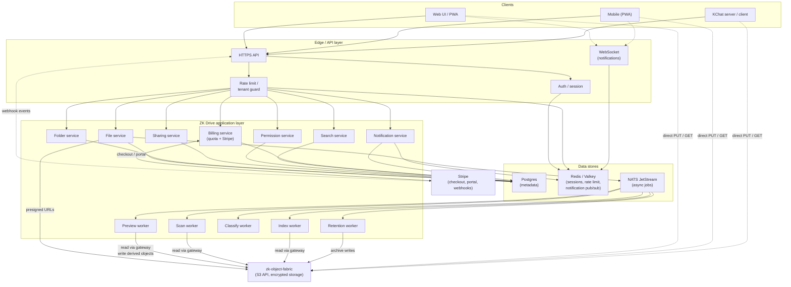
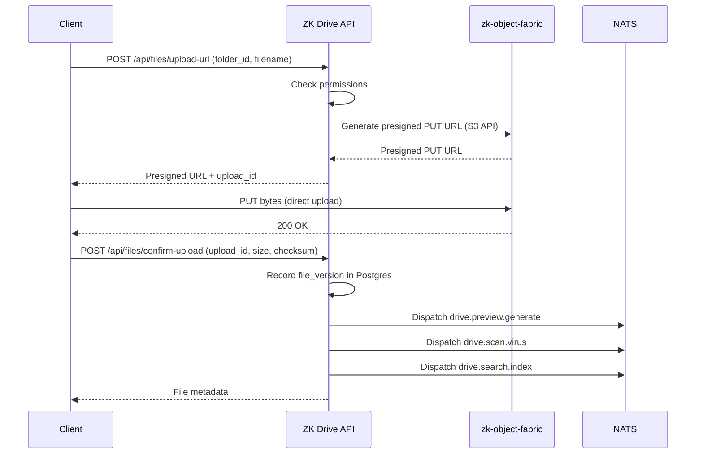
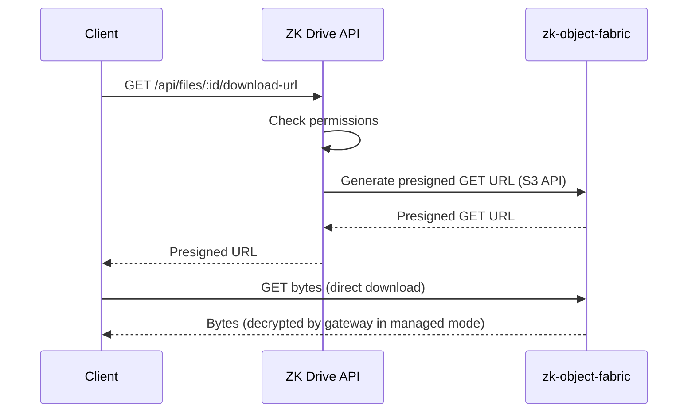

# ZK Drive — Architecture

**License**: Proprietary — All Rights Reserved.

This document describes the system architecture of ZK Drive: the data
model, API surface, async pipelines, encryption integration with
zk-object-fabric, and the deployment topology.

---

## 1. System Overview

ZK Drive is a document management application layer on top of
[zk-object-fabric](https://github.com/kennguy3n/zk-object-fabric). It
manages users, workspaces, folders, permissions, sharing, and file
metadata in Postgres. It delegates **all** file content storage to
zk-object-fabric via its S3-compatible API. It does not implement its
own encryption, cache, placement engine, or provider-migration engine
— those are owned by zk-object-fabric.



The ZK Drive API server is **not** on the byte path. Clients upload
and download directly to zk-object-fabric via presigned URLs. ZK
Drive brokers permissions, records metadata, and dispatches async
jobs.

---

## 2. Data Model

### 2.1 Core entities

- **Workspace** — the tenant unit. Every user, folder, file, and
  permission record belongs to exactly one workspace.
- **User** — a person with a workspace-scoped account.
- **Folder** — a node in a folder tree. Nullable `parent_folder_id`
  for the workspace root.
- **File** — a logical file identity. Points to a current version.
- **FileVersion** — an immutable version of a file's content. Each
  version owns one object key in zk-object-fabric.
- **Permission** — a grant of a role (view / edit / admin) on a
  resource (folder or file) to a grantee (user or guest).
- **ShareLink** — a token-based public or password-protected link to
  a resource.
- **GuestInvite** — an email-scoped invite granting a role on a
  specific folder, with expiry.
- **ActivityLog** — an append-only log of user and admin actions.

### 2.2 Postgres schema (conceptual)

This is the conceptual shape, not DDL. Migration files land in
`migrations/`.

- `workspaces`: `id`, `name`, `owner_user_id`, `storage_quota_bytes`,
  `storage_used_bytes`, `tier`, `created_at`.
- `users`: `id`, `workspace_id`, `email`, `name`, `role`,
  `created_at`.
- `folders`: `id`, `workspace_id`, `parent_folder_id` (nullable for
  root), `name`, `path`, `created_by`, `created_at`.
- `files`: `id`, `workspace_id`, `folder_id`, `name`,
  `current_version_id`, `size_bytes`, `mime_type`, `created_by`,
  `created_at`, `deleted_at` (soft delete).
- `file_versions`: `id`, `file_id`, `version_number`, `object_key`
  (S3 key in zk-object-fabric), `size_bytes`, `checksum`,
  `created_by`, `created_at`.
- `permissions`: `id`, `resource_type` (folder | file), `resource_id`,
  `grantee_type` (user | guest), `grantee_id`, `role` (view | edit |
  admin), `created_at`, `expires_at`.
- `share_links`: `id`, `resource_type`, `resource_id`, `token`,
  `password_hash`, `expires_at`, `max_downloads`, `download_count`,
  `created_by`, `created_at`.
- `guest_invites`: `id`, `workspace_id`, `email`, `folder_id`,
  `role`, `expires_at`, `accepted_at`, `created_by`.
- `activity_log`: `id`, `workspace_id`, `user_id`, `action`,
  `resource_type`, `resource_id`, `metadata_json`, `created_at`.

Every table carries `workspace_id` so row-level isolation can be
enforced at the query layer (see §9).

---

## 3. API Design

ZK Drive exposes a REST API over HTTPS. Operations are scoped by an
authenticated session; tenant resolution happens in middleware.

### 3.1 Auth

- `POST /api/auth/signup`
- `POST /api/auth/login`
- `POST /api/auth/logout`
- `POST /api/auth/refresh`

### 3.2 Workspaces

- `GET /api/workspaces`
- `POST /api/workspaces`
- `GET /api/workspaces/:id`
- `PUT /api/workspaces/:id`

### 3.3 Folders

- `GET /api/folders/:id`
- `POST /api/folders`
- `PUT /api/folders/:id`
- `DELETE /api/folders/:id`
- `POST /api/folders/:id/move`

### 3.4 Files

- `GET /api/files/:id`
- `POST /api/files/upload-url` — returns a presigned PUT URL scoped
  to a single object key in zk-object-fabric, plus an upload ID.
- `POST /api/files/confirm-upload` — records the file version in
  Postgres and dispatches preview / scan / index jobs.
- `PUT /api/files/:id` — rename / update metadata.
- `DELETE /api/files/:id` — soft delete (trash).
- `POST /api/files/:id/move`
- `POST /api/files/:id/copy`
- `GET /api/files/:id/versions`
- `POST /api/files/:id/restore/:version_id`
- `GET /api/files/:id/download-url` — returns a presigned GET URL.
- `GET /api/files/:id/preview-url` — returns a presigned GET URL
  for the derived preview object (PNG thumbnail). Returns 404 when
  no preview has been generated yet (e.g. unsupported mime type, or
  strict-ZK folder).

### 3.5 Sharing

- `POST /api/share-links`
- `GET /api/share-links/:token`
- `DELETE /api/share-links/:id`
- `POST /api/guest-invites`
- `DELETE /api/guest-invites/:id`

### 3.6 Search

- `GET /api/search?q=...`

### 3.7 Admin

- `GET /api/admin/users`
- `POST /api/admin/users`
- `DELETE /api/admin/users/:id`
- `GET /api/admin/audit-log`
- `GET /api/admin/storage-usage`
- `GET /api/admin/billing/plan` — current plan tier and limits.
- `PUT /api/admin/billing/plan` — manual tier override (e.g. for
  internal accounts; production tier changes flow through Stripe).
- `POST /api/admin/billing/checkout-session` — mints a Stripe
  Checkout session for the requested tier.
- `POST /api/admin/billing/portal-session` — mints a Stripe
  Customer Portal session so the workspace owner can manage their
  subscription.
- `GET /api/admin/placement` / `PUT /api/admin/placement` —
  workspace placement policy (provider / region / country /
  storage class), proxied to zk-object-fabric after local validation
  via `placement_policy.Policy.Validate()`.
- `GET /api/admin/cmk` / `PUT /api/admin/cmk` — customer-managed
  key URI (`arn:aws:kms:`, `kms://`, `vault://`, `transit://`, or
  empty for gateway-default), validated by
  `internal/crypto/cmk.go` and best-effort forwarded to the fabric
  console via `fabric.Client.PutCMK`.
- `GET /api/admin/retention-policies` / `POST /api/admin/retention-policies`
  / `PUT /api/admin/retention-policies/:id` /
  `DELETE /api/admin/retention-policies/:id` — workspace + folder
  retention rules with archive / delete thresholds.

All admin routes are gated by an `AdminOnly` middleware that
requires `users.role == 'admin'`.

### 3.8 KChat Integration

KChat-specific endpoints live under `/api/kchat`. See
`api/kchat/handler.go` for the full surface.

- `POST /api/kchat/rooms` — map a KChat room ID to a freshly
  provisioned room folder (admin only).
- `GET /api/kchat/rooms` — list every mapping in the workspace.
- `GET /api/kchat/rooms/:id` — fetch a single mapping.
- `DELETE /api/kchat/rooms/:id` — remove the mapping (the backing
  folder is left intact; admin only).
- `POST /api/kchat/rooms/:id/sync-members` — reconcile the room's
  member list against the folder's user grants (admin only).
- `POST /api/kchat/attachments/upload-url` — mint a presigned PUT
  URL keyed by `{workspace_id}/{file_id}/{version_id}` scoped to
  the room folder.
- `POST /api/kchat/attachments/confirm` — promote a previously
  minted upload URL into a `FileVersion` after validating the
  object-key prefix.
- `POST /api/kchat/rooms/:id/summary` — return a rule-based (or
  local-LLM-backed) summary of the files in the mapped folder.
  Strict-ZK folders return `403` via `ai.ErrStrictZKForbidden`.

### 3.9 WebSocket Notifications

- `GET /api/ws` — WebSocket upgrade endpoint for real-time
  notifications. The middleware chain populates
  `(workspaceID, userID)` from the JWT before the upgrade so an
  unauthenticated request is rejected with `401`. See
  `api/ws/handler.go` for the Hub + read/write pump implementation.

### 3.10 Webhooks

- `POST /api/webhooks/stripe` — Stripe event ingestion. Verifies
  the `Stripe-Signature` header against `STRIPE_WEBHOOK_SECRET`,
  caps the request body at 64 KiB, and updates `workspace_plans`
  rows for `checkout.session.completed`, `customer.subscription.*`,
  and `invoice.*` events. See `internal/billing/stripe.go`.

### 3.11 Client Rooms

Client rooms are dedicated shared folders for external
collaboration (agencies, accounting, legal, construction, clinic
verticals). They pair a folder with a share link and optional
pre-configured sub-folder structure.

- `POST /api/client-rooms` — create an ad-hoc client room (folder
  + share link bundle).
- `GET /api/client-rooms` — list client rooms in the workspace.
- `GET /api/client-rooms/:id` — fetch a single room.
- `DELETE /api/client-rooms/:id` — delete the room and its
  backing share link.
- `GET /api/client-rooms/templates` — list available templates
  (agency, accounting, legal, construction, clinic).
- `POST /api/client-rooms/from-template` — create a room from a
  named template; `ClientRoomService.CreateFromTemplate`
  provisions the matching sub-folder layout under the room folder.

### 3.12 Notifications

- `GET /api/notifications` — list notifications for the current
  user, unread first. Server-side pagination via `limit` /
  `offset`.
- `POST /api/notifications/:id/read` — mark a single notification
  read.
- `POST /api/notifications/read-all` — mark every notification
  for the current user read.

---

## 4. Upload and Download Flows

### 4.1 Upload flow



### 4.2 Download flow



In both flows, ZK Drive is **not** on the byte path. The ZK Drive API
servers handle metadata, permissions, and URL brokering; the bytes
flow directly between the client and the zk-object-fabric data plane.

---

## 5. Async Job Architecture

All long-running work runs as NATS JetStream consumers.

### 5.1 Subjects

- `drive.preview.generate` — generate thumbnails / previews.
- `drive.scan.virus` — run ClamAV on a newly uploaded file.
- `drive.search.index` — extract text from managed-encrypted
  documents and update Postgres FTS.
- `drive.retention.evaluate` — evaluate retention policy for a
  file / folder and schedule archival or deletion.
- `drive.archive.cold` — compress and archive expired file versions.

### 5.2 Worker types

| Worker           | Tools                                    | Mode constraint               |
| ---------------- | ---------------------------------------- | ----------------------------- |
| Preview worker   | LibreOffice + ImageMagick + FFmpeg       | Managed encrypted only        |
| Scan worker      | ClamAV                                   | Managed encrypted only        |
| Index worker     | Extract text → Postgres `tsvector`       | Managed encrypted only        |
| Retention worker | Postgres reads + NATS fan-out            | All modes                     |
| Archive worker   | Compress + zk-object-fabric archive PUT  | All modes                     |

Strict-ZK files are skipped by preview, scan, and index workers —
the workers do not have the plaintext.

---

## 6. Search Architecture

### 6.1 Default — Postgres FTS

Search runs on Postgres FTS using `tsvector` / `tsquery`. Indexed
fields:

- File names.
- Folder names.
- User-applied tags.
- Extracted text from managed-encrypted documents (populated by the
  index worker).

Postgres FTS is cheap, operationally free (already in the stack), and
good enough for the SME query mix.

### 6.2 Optional dedicated tier — OpenSearch / Meilisearch

A dedicated search tier is introduced only when Postgres FTS cannot
hit the latency target (~500 ms p95) or the corpus exceeds a few
million documents per workspace. The dedicated tier runs as a
consumer of `drive.search.index` events alongside Postgres FTS, not
as a replacement. Postgres FTS remains the source of truth for file
and folder name search.

### 6.3 Strict-ZK files

Strict-ZK files are **not** searchable by content from the server.
The server has only the ciphertext and cannot extract text. File
names, folder names, and tags remain searchable because application-
layer metadata is not encrypted.

This is an explicit tradeoff of strict-ZK mode and must be surfaced
in the UI.

---

## 7. Permission Model

### 7.1 Roles

- **Admin** — full control of the resource: edit, share, manage
  sub-permissions, delete.
- **Editor** — read and write file content and metadata; create and
  rename children; cannot change sharing.
- **Viewer** — read-only access.

Role hierarchy: Admin > Editor > Viewer. A grantee's effective role
on a resource is the maximum of all applicable grants (direct and
inherited).

### 7.2 Inheritance

Folder permissions inherit to child folders and files. An explicit
grant on a child overrides the inherited grant for that grantee.
Removing an explicit grant restores the inherited grant.

### 7.3 Share links vs. user permissions

Share links are **independent** of user permissions. A share-link
token grants access regardless of any user / guest permission
record. Share links can carry a password, an expiry, and a
download cap. Revoking a share link invalidates the token immediately
(enforced at URL generation time).

### 7.4 Guest invites

Guest invites create `permissions` rows with `grantee_type = 'guest'`
and an `expires_at` timestamp. The retention worker revokes expired
guest permissions on a schedule.

---

## 8. Encryption Integration

ZK Drive does **not** perform encryption itself. Encryption is
delegated entirely to zk-object-fabric's mode selection.

### 8.1 Managed encrypted mode

- zk-object-fabric `ManagedEncrypted`.
- The gateway manages keys and can decrypt plaintext in memory during
  request handling.
- ZK Drive preview, scan, and index workers can request decrypted
  reads via the gateway and therefore support previews, virus
  scanning, and full-text search.
- Default mode for all new folders.

### 8.2 Strict-ZK mode

- zk-object-fabric `StrictZK`.
- Clients encrypt via the zk-object-fabric client SDK before upload
  and decrypt after download.
- ZK Drive stores only encrypted objects and opaque application-layer
  metadata. It cannot generate previews, extract text, or scan
  content.
- Users accept this tradeoff when opting a folder into strict-ZK.

### 8.3 Per-folder mode selection

Each folder carries an `encryption_mode` column stored in the
`folders` table. The API enforces mode consistency:

- Files inherit their folder's mode.
- Moving a file to a folder in a different mode requires an explicit
  re-upload in the new mode; it is not a silent metadata move.
- The UI surfaces the mode on every folder and warns on mode changes.

---

## 9. Multi-Tenancy

- **Workspace = tenant.** Every data row has a `workspace_id`.
- **Postgres row-level isolation** — every query filters by
  `workspace_id`. Application middleware binds the authenticated
  session to a single workspace and rejects cross-workspace reads.
- **Redis key prefixing** — session and cache keys are namespaced by
  `workspace_id` so a Redis misread cannot leak across tenants.
- **Object key namespace** — zk-object-fabric is organized either
  bucket-per-workspace (the simpler layout, used for single-workspace
  and small multi-tenant deployments) or prefix-per-workspace within a
  shared bucket (used at scale when bucket counts matter). Either way,
  the object key is derived from the workspace ID and is not trusted
  from the client.

---

## 10. WebSocket & Real-Time Notifications

Real-time notifications (share-link created, guest invite accepted,
scan quarantine, file upload, permission changes) are delivered to
live web clients over WebSocket. The transport sits behind
`api/ws/handler.go` and the `notification` service publishes events
on both the in-process hub and Redis pub/sub.

### 10.1 Hub

`api/ws.Hub` keeps a per-`(workspaceID, userID)` set of WebSocket
clients. Each client owns a bounded send channel; slow consumers
are unregistered (and the connection closed) instead of stalling
the broadcaster. Auth + tenant guard run before the upgrade so the
upgraded connection is already bound to a workspace and user.

### 10.2 Multi-replica fan-out via Redis pub/sub

In a multi-replica deployment a notification produced on replica A
still needs to reach the live WebSocket connections held by
replica B. The notification service therefore publishes every event
on a Redis pub/sub channel (`internal/notification/publisher.go`);
every replica subscribes and re-broadcasts to its local hub via
`Hub.BroadcastJSON`. Single-replica deployments work transparently
because the same publisher also dispatches directly to the
in-process hub.

### 10.3 Frontend

The frontend opens a single WebSocket connection on login through
the `useNotifications` hook, falls back to REST polling of
`/api/notifications` if the upgrade fails, and surfaces unread
badges in the top bar.

### 10.4 Change Feed (desktop sync transport)

The change feed is the durable, monotonically-ordered stream of
state-mutating operations on a workspace's files / folders /
permissions. It is the transport the desktop sync SDK
(`sdk/crates/sync-engine`), the embedding shell
(`sdk/crates/desktop-shell`), and future native mobile clients use
to keep a local replica in sync with the server.

The transport has two halves:

- **Catch-up** — `GET /api/changes?since={cursor}&limit={N}`
  returns mutations strictly after `cursor`, ordered ascending.
  Clients pass the highest sequence they have processed; the
  response advances the cursor and reports `has_more` so a client
  can keep paging until caught up. `GET /api/changes/latest`
  returns the workspace's current head cursor.
- **Live push** — every new mutation is broadcast workspace-wide
  over the existing `/api/ws` hub as a `{"type":"change", ...}`
  envelope. The hub is extended with `BroadcastJSONWorkspace` so a
  single mutation reaches every connected user of the workspace
  irrespective of `clientKey.userID`.

Mutations are persisted to a dedicated `change_log` table (see
`migrations/029_change_log.up.sql`) with a `BIGSERIAL` sequence
column that provides the cursor. The change feed is intentionally
separate from `activity_log`: activity is async / fire-and-forget
telemetry (the buffer drops on overflow), but the change feed must
be synchronous so sync clients never miss an event because a
buffer was full. The two stores share the action vocabulary —
`internal/activity` action constants drive the change-feed
mapping in `api/drive.changefeedKindOpFor`.

Read-only actions (`file.download`, `file.bulk.download`) and any
unmapped future action are explicitly absent from the feed.

### Visibility model — metadata vs content

The change feed is workspace-wide and exposes every mutation to
every authenticated workspace member, regardless of per-resource
ACLs. This is intentional and matches the existing semantics of
`activity_log`: a member who lacks read access to file `foo.docx`
can still see "Alice moved foo.docx to /Reports/" in the activity
feed today, and the same goes for the change feed.

This is a **metadata-only** exposure: the feed records names,
parent IDs, action kinds, and small structured metadata, never
file bytes. Sync clients apply per-resource access filtering
locally when deciding whether to fetch content via presigned URLs
(`api/drive/file.go` permission checks still gate every download).
For workspaces where file existence itself must be hidden from
some members, the product answer is a separate workspace, not
metadata redaction.

**StrictZK folders**: the zero-knowledge guarantee covers file
*contents* — not folder/file names or structural metadata. The
change feed records names for StrictZK resources just like
managed-encrypted resources, because sync clients (and the activity
log) need them. Customers who require name-level secrecy (e.g.
filenames are themselves sensitive) should use the workspace-level
isolation path described above, not a per-folder option.

### Multi-replica fan-out

In multi-replica deployments the change feed uses a separate
Redis pub/sub channel namespace (`ws-workspace:{workspaceID}`)
from the per-user notification channels (`ws:{workspaceID}:{userID}`)
so the two streams can be migrated / partitioned independently.

---

## 11. Session & Rate Limiting

Production deployments use a Redis-backed session store and a
Redis-backed distributed rate limiter so sessions can be revoked
centrally and rate limits stay correct across multiple API replicas.
In-memory fallbacks are available for single-replica deployments and
local development.

### 11.1 Session store

`internal/session/redis.go` records every session in Redis as
`ws:{workspaceID}:session:{sessionID}` with a secondary user-index
set (`ws:{workspaceID}:user_sessions:{userID}`) so admin
"force sign-out" flows can wipe every session for an identity
without scanning the keyspace. Keys are namespaced by
`workspace_id` per §9 to keep multi-tenant isolation honest.

### 11.2 Distributed rate limiter

`api/middleware/ratelimit_redis.go` is a sliding-window counter
implemented as a Lua script that runs atomically on the Redis
server. The script:

1. `INCR` the per-`(workspace_id, user_id)` counter and apply the
   user budget; rejects above-budget requests immediately.
2. `INCR` the per-`workspace_id` counter and apply the workspace
   budget; refunds the user counter (`DECR`) on workspace denial
   so a noisy neighbour cannot starve the whole workspace.
3. Returns `{status, user_count, ws_count}` so the middleware can
   set `Retry-After` and `X-RateLimit-*` headers correctly.

When `REDIS_URL` is unset, both the session store and the rate
limiter fall back to in-memory implementations. This keeps
`go test -short` and local development cheap, and lets single-replica
deployments run without standing up Redis. Production deployments are
expected to set `REDIS_URL`.

---

## 12. Billing & Stripe Integration

Billing is two-sided: ZK Drive itself enforces per-workspace
storage / user / bandwidth quotas, and Stripe is the source of
truth for which plan tier the workspace currently has. Both halves
live under `internal/billing/`.

### 12.1 Quota enforcement

`workspace_plans` (migration 016) stores the per-workspace tier and
overridable limits. `usage_events` is an append-only ledger of
storage / bandwidth / user-added events. The quota checkers
(`CheckStorageQuota`, `CheckUserQuota`, `CheckBandwidthQuota`) read
current-state counters (`files`, `users`, month-to-date sum of
bandwidth events) rather than replaying the full ledger, and run
before mutating endpoints (upload URL minting, user invites).

### 12.2 Stripe webhook

`internal/billing/stripe.go` verifies the `Stripe-Signature` header
against `STRIPE_WEBHOOK_SECRET`, caps the request body at 64 KiB,
and routes `checkout.session.completed`,
`customer.subscription.*`, and `invoice.*` events to
`Service.UpdateTier` (which preserves any per-workspace tier
override an admin set out-of-band) and `Service.SetStripeCustomerID`.
`workspace_plans.stripe_customer_id` (migration 023) lets the
admin checkout / portal flows look up an existing customer.

### 12.3 Checkout + Customer Portal

`POST /api/admin/billing/checkout-session` mints a Stripe Checkout
session for the requested tier; `POST
/api/admin/billing/portal-session` mints a Customer Portal session
so the workspace owner can manage their subscription, payment
methods, and invoices. The frontend `BillingPage.tsx` exposes both
behind upgrade / manage buttons.

---

## 13. KChat Integration Architecture

KChat is a separate B2B team chat product that uses ZK Drive as
its storage backbone. The dependency is **one-directional**: KChat
depends on ZK Drive, but ZK Drive does not depend on KChat. The
integration surface is the REST API documented in §3.8 plus the
shared zk-object-fabric S3 API.

### 13.1 Service + repository

`internal/kchat/` holds the integration logic. `RoomService`
coordinates folder creation, permission grants, and attachment
metadata; `RoomFolderRepository` persists the mapping rows. The
package uses small interfaces (`FolderCreator`, `PermissionGranter`,
`FileCreator`) instead of importing `internal/folder`,
`internal/permission`, and `internal/file` directly, so the
coupling stays one-way.

### 13.2 Room-folder mapping

Migration 021 creates `kchat_room_folders` with a unique constraint
on `(workspace_id, kchat_room_id)`. Creating a mapping provisions a
dedicated room folder under the workspace root, grants the caller
admin on it, and records the row. Deleting the mapping removes
only the row — the backing folder is intentionally retained so
operators keep the uploaded files even after the chat room is
gone.

### 13.3 Permission sync

`RoomService.SyncMembers` is idempotent: it indexes every existing
`user`-type grant on the folder, revokes anything not in the
desired set, and adds or upgrades the rest. Guest grants are
left alone so KChat sync never clobbers an out-of-band guest
invite.

### 13.4 Attachment metadata

`AttachmentUploadURL` resolves the room's folder, creates the
file metadata row up front, and mints a presigned PUT keyed by
`{workspace_id}/{file_id}/{version_id}`. `ConfirmAttachment`
validates the object-key prefix before flipping the file's
current-version pointer, so a malicious caller cannot graft an
arbitrary key onto someone else's file row.

---

## 14. AI & Classification

AI features are limited to managed-encrypted folders by design:
the server has no plaintext access to strict-ZK content, so any AI
path that would summarise or classify file content explicitly
refuses for strict-ZK folders.

### 14.1 Thread / room summary

`internal/ai/service.go` is a rule-based scaffold that assembles a
fixed-format summary from folder file names and any indexed
`content_text`. It is the path of last resort; it never makes
network calls.

`internal/ai/llm.go` is an Ollama-compatible local-LLM client
behind the `LLMClient` interface. The default model is
`qwen2.5:1.5b` (Apache-2.0 weights, ~1 GB on disk, runs CPU-only
on a 4 GB host). The constructor refuses any non-loopback /
non-RFC1918 endpoint at boot — sending file or chat content to a
third-party API would silently undo the zero-knowledge contract
the rest of the product enforces. When `OLLAMA_URL` is unset, the
summary service stays on the rule-based scaffold and never makes
a network call.

Strict-ZK folders return `ErrStrictZKForbidden`, which the handler
layer maps to `403 Forbidden`.

Configuration:

- `OLLAMA_URL` — endpoint for the local Ollama daemon (default
  `http://127.0.0.1:11434`). Must be loopback / RFC1918 / `.local`
  / `.internal` / `.cluster.local`; constructors reject anything
  else.
- `OLLAMA_MODEL` — model identifier (default `qwen2.5:1.5b`).

### 14.2 File classification

`internal/classify/service.go` is a small rule-based classifier
that labels a file row as `image` / `invoice` / `contract` /
`document` / `other` based on filename and mime type. The label
is persisted to `files.classification` (migration 022). The
worker subscribes to `drive.classify.file` (added to the
`DRIVE_JOBS` NATS stream); strict-ZK files are skipped at the
worker boundary so the data plane is never touched.

---

## 15. Preview Pipeline

Previews are generated by a NATS-driven worker and stored as
derived objects in zk-object-fabric.

### 15.1 Dispatch model

`internal/preview` exposes a `Renderer` interface plus a
package-level MIME-type → `Renderer` registry. Each handler file
(image / pdf / office / text / video / audio / svg / archive /
email / design) declares its MIME types in an `init()` that calls
`Register(...)`, so adding a new format never touches the
service. `Service.Generate` is a single registry lookup plus the
shared resize-and-encode path.

The 100 MiB source cap (`MaxSourceBytes`) applies to every
handler — the source is read through an `io.LimitReader` before
any decoder sees it.

Strict-ZK files never reach the preview worker — the worker's
NATS handler short-circuits with `isStrictZK(ctx, pool, fileID)`
before calling the service.

### 15.2 In-process renderers

Pure-Go, no external binaries:

- **Images (`image.go`)**: PNG / JPEG / GIF via the stdlib
  `image` package, plus WebP via `golang.org/x/image/webp`.
- **Text & code (`text.go`)**: monospace-font rasterisation of
  the first ~16 KiB of source via
  `golang.org/x/image/font/inconsolata`. Wired to every common
  text / code / config MIME (text/*, application/json,
  application/javascript, application/x-yaml, …). Non-printable
  bytes are mapped to spaces so a binary blob masquerading as
  text/* doesn't break the renderer.
- **Archives (`archive.go`)**: ZIP / TAR / TAR.GZ listings via
  `archive/zip` and `archive/tar`. Inner files are never
  extracted — the preview only shows the file tree. Listings are
  capped at 64 entries and sorted (directories first,
  alphabetically) for a deterministic output.
- **Email (`email.go`)**: RFC 5322 `.eml` via `net/mail`.
  Renders From / To / Date / Subject as a header, then the first
  ~6 KiB of body. MIME boundaries are stripped so multipart
  bodies don't render as a wall of `--boundary` markers. Outlook
  `.msg` (TNEF / CFB) is intentionally not wired — it needs a
  separate parser and is rarely the canonical archive format.

### 15.3 Subprocess renderers

All of these shell out to a binary and fall back to
`ErrUnsupportedMime` when the binary is missing — that mapping
is enforced by `missingBinaryErr` so a misconfigured host
yields a graceful "skip this job" rather than a Nak loop.

- **PDF (`pdf.go`)**: `pdftoppm` (poppler-utils, GPL). Page 1
  at 150 DPI.
- **Office (`office.go`)**: `soffice --headless --convert-to
  pdf` (LibreOffice, MPL-2.0) → `pdftoppm`. Covers DOCX /
  XLSX / PPTX / DOC / XLS / PPT / ODT / ODS / ODP / RTF. Each
  invocation gets a hermetic `$HOME` under the per-call temp
  dir so concurrent worker goroutines don't fight over a
  shared LibreOffice profile. Hard timeout: 30 s.
- **Video (`video.go`)**: `ffmpeg` (LGPL) frame extraction at
  `t=00:00:01`. Falls back to the first frame if `-ss 1` can't
  find one (clip < 1 s, keyframe past offset). Hard timeout:
  15 s.
- **Audio (`audio.go`)**: `audiowaveform` (BBC R&D, GPL) if
  available, otherwise `ffmpeg`'s `showwavespic` filter.
  Either tool produces a colourised PNG waveform. Hard
  timeout: 20 s.
- **SVG (`svg.go`)**: `rsvg-convert` (librsvg, LGPL) at 600 px
  working width.
- **Design / extended raster (`design.go`)**: ImageMagick
  `convert`. Covers PSD / AI / EPS / TIFF / BMP / ICO / HEIC /
  HEIF. Uses `in[0]` + `-flatten` so a multi-layer PSD or
  multi-page AI renders as a single thumbnail. `convert` is
  overridable to `magick` via `SetImageMagickBinary` for
  ImageMagick 7 deployments.

### 15.4 Runtime image

The runtime Dockerfile installs the full set of external tools
(poppler-utils, libreoffice-{core,writer,calc,impress}, ffmpeg,
librsvg2-bin, imagemagick) and relaxes the default ImageMagick
PostScript / PDF policies so the design renderer can rasterise
AI / EPS / PDF-via-IM inputs. Each tool's licence is called out
inline in the Dockerfile so the proprietary-build implications
stay auditable from one file.

`audiowaveform` is intentionally NOT installed in the default
image because the upstream Debian package is not available
everywhere; the audio handler transparently falls back to
`ffmpeg`'s `showwavespic` filter when the BBC tool is missing.
Bake it in per-deployment if you want the BBC-quality output.

### 15.5 Storage layout

Every preview is stored at

```
{workspace_id}/{file_id}/{version_id}/preview.png
```

in the same zk-object-fabric bucket as the source file, and a row
is indexed in `file_previews` so the API can resolve a preview URL
without scanning the bucket.

---

## 16. PWA Architecture

The frontend ships as a Progressive Web App so SMEs can install
ZK Drive as a phone home-screen icon without requiring a separate
native mobile build.

- **Build integration**: `vite-plugin-pwa` injects the manifest and
  service worker into the Vite production build.
- **Manifest**: `frontend/public/manifest.webmanifest` declares
  app name, short name, start URL, `display: standalone`, theme
  and background colours, and the icon set. The manifest is linked
  from `index.html` via the `vite-plugin-pwa` integration.
- **Service worker**: a Workbox-generated precaching service
  worker caches the static SPA bundle so cold app launches work
  offline. API requests stay network-first; sensitive endpoints
  (`/api/files/*/download`, strict-ZK folder listings) are
  deliberately excluded from caching so decryption material and
  zero-knowledge content are never persisted locally.
- **Offline support**: the SPA shell loads offline. Read-only
  access to the most recently opened folder tree falls back
  gracefully when the network is unavailable; write operations
  require connectivity.
- **Install prompt**: the `InstallPrompt` component listens for
  `beforeinstallprompt`, surfaces an "Install app" button on the
  file browser, and hides itself once the app is installed or the
  user dismisses the prompt.
- **Icons and splash screens**: Apple touch icons and Android
  splash screens are served from `frontend/public/icons/`.
- **Push notifications**: not currently wired. Real-time
  notifications are delivered over WebSockets while the app is
  open; Web Push can be layered in later if mobile usage warrants
  the additional surface.

The PWA is the single mobile surface today. A dedicated React
Native client would add ~8 – 10 engineer-weeks for feature parity
plus an ongoing app-store compliance overhead, and would need a
server-side delta-pull endpoint to enable true offline operation
(none exists today). Until measurable PWA install traction
justifies that investment, the PWA stays the only mobile path.

---

## 17. Deployment Architecture

The deployment surface is shipped as code. There is one Go binary
for the API server (`cmd/server`), one Go binary for the worker
bus (`cmd/worker`), and a thin React build for the frontend served
by the API server.

### 17.1 Local development — `docker-compose.yml`

The top-level `docker-compose.yml` is the one-command local stack:

- `postgres` — Postgres 16 with the `zkdrive` role and `zk-drive`
  database.
- `nats` — NATS JetStream broker for the preview / scan / index /
  classify / retention / archive workers.
- `clamav` — ClamAV daemon (clamav/clamav:1.3) used by the scan
  worker over INSTREAM. Not linked into the build; the daemon's
  GPL-2.0 license stays at the same posture as Postgres.
- `server` — the API server (`cmd/server`).
- `worker` — the async worker (`cmd/worker`).

### 17.2 Production compose — `deploy/docker-compose.prod.yml`

`deploy/docker-compose.prod.yml` is the production-shaped compose
file (managed Postgres / NATS pointed at by env vars, no in-stack
databases). It is the recommended path for SMEs that don't run a
Kubernetes cluster.

### 17.3 Kubernetes — `deploy/k8s/`

The `deploy/k8s/` directory holds dev / staging Kubernetes
manifests:

- `namespace.yaml`
- `configmap.yaml`
- `secret.yaml`
- `server.yaml`
- `worker.yaml`
- `postgres.yaml` — single-replica StatefulSet, dev / staging only.
- `nats.yaml`
- `clamav.yaml`
- `ingress.yaml`

The k8s manifests are explicitly dev / staging only: there is no
HorizontalPodAutoscaler, no PodDisruptionBudget, and the Postgres
StatefulSet is single-replica. Production is expected to use
managed Postgres (RDS / Cloud SQL) and managed NATS, with the
production compose or a customer's existing platform handling the
app tier. See [`deploy/README.md`](../deploy/README.md) for the
production deployment guidance.
