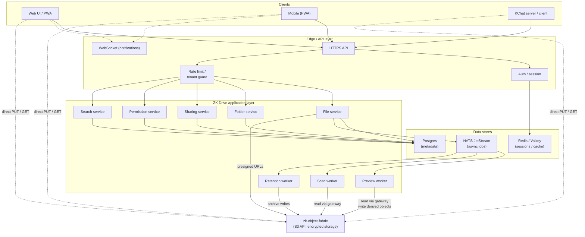
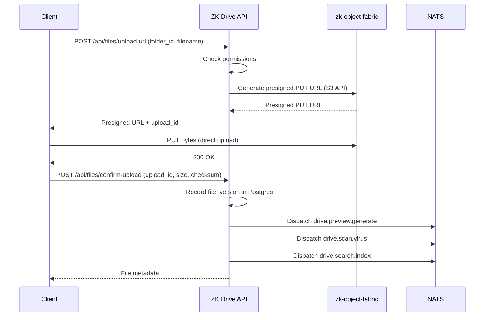
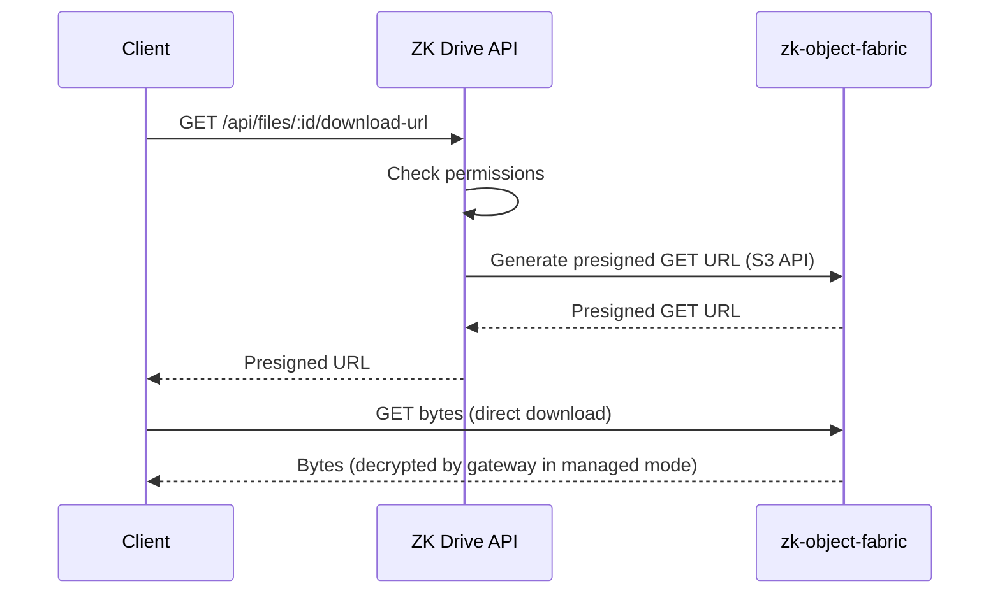

# ZK Drive — Architecture

**License**: Proprietary — All Rights Reserved.

> Status: Phase 1 — Foundation (not started). This document describes
> the target architecture. See [PROGRESS.md](PROGRESS.md) for build
> status and [PROPOSAL.md](PROPOSAL.md) for product strategy.

---

## 1. System Overview

ZK Drive is a document management application layer on top of
[zk-object-fabric](https://github.com/kennguy3n/zk-object-fabric). It
manages users, workspaces, folders, permissions, sharing, and file
metadata in Postgres. It delegates **all** file content storage to
zk-object-fabric via its S3-compatible API. It does not implement its
own encryption, cache, placement engine, or provider-migration engine
— those are owned by zk-object-fabric.

The ZK Drive API server is **not** on the byte path. Clients upload
and download directly to zk-object-fabric via presigned URLs. ZK
Drive brokers permissions, records metadata, and dispatches async
jobs.

---

## 2. Data Model

### 2.1 Core entities

- **Workspace** — the tenant unit. Every user, folder, file, and
  permission record belongs to exactly one workspace.
- **User** — a person with a workspace-scoped account.
- **Folder** — a node in a folder tree. Nullable `parent_folder_id`
  for the workspace root.
- **File** — a logical file identity. Points to a current version.
- **FileVersion** — an immutable version of a file's content. Each
  version owns one object key in zk-object-fabric.
- **Permission** — a grant of a role (view / edit / admin) on a
  resource (folder or file) to a grantee (user or guest).
- **ShareLink** — a token-based public or password-protected link to
  a resource.
- **GuestInvite** — an email-scoped invite granting a role on a
  specific folder, with expiry.
- **ActivityLog** — an append-only log of user and admin actions.

### 2.2 Postgres schema (conceptual)

This is the conceptual shape, not DDL. Migration files land in
`migrations/`.

- `workspaces`: `id`, `name`, `owner_user_id`, `storage_quota_bytes`,
  `storage_used_bytes`, `tier`, `created_at`.
- `users`: `id`, `workspace_id`, `email`, `name`, `role`,
  `created_at`.
- `folders`: `id`, `workspace_id`, `parent_folder_id` (nullable for
  root), `name`, `path`, `created_by`, `created_at`.
- `files`: `id`, `workspace_id`, `folder_id`, `name`,
  `current_version_id`, `size_bytes`, `mime_type`, `created_by`,
  `created_at`, `deleted_at` (soft delete).
- `file_versions`: `id`, `file_id`, `version_number`, `object_key`
  (S3 key in zk-object-fabric), `size_bytes`, `checksum`,
  `created_by`, `created_at`.
- `permissions`: `id`, `resource_type` (folder | file), `resource_id`,
  `grantee_type` (user | guest), `grantee_id`, `role` (view | edit |
  admin), `created_at`, `expires_at`.
- `share_links`: `id`, `resource_type`, `resource_id`, `token`,
  `password_hash`, `expires_at`, `max_downloads`, `download_count`,
  `created_by`, `created_at`.
- `guest_invites`: `id`, `workspace_id`, `email`, `folder_id`,
  `role`, `expires_at`, `accepted_at`, `created_by`.
- `activity_log`: `id`, `workspace_id`, `user_id`, `action`,
  `resource_type`, `resource_id`, `metadata_json`, `created_at`.

Every table carries `workspace_id` so row-level isolation can be
enforced at the query layer (see §9).

---

## 3. API Design

ZK Drive exposes a REST API over HTTPS. Operations are scoped by an
authenticated session; tenant resolution happens in middleware.

### 3.1 Auth

- `POST /api/auth/signup`
- `POST /api/auth/login`
- `POST /api/auth/logout`
- `POST /api/auth/refresh`

### 3.2 Workspaces

- `GET /api/workspaces`
- `POST /api/workspaces`
- `GET /api/workspaces/:id`
- `PUT /api/workspaces/:id`

### 3.3 Folders

- `GET /api/folders/:id`
- `POST /api/folders`
- `PUT /api/folders/:id`
- `DELETE /api/folders/:id`
- `POST /api/folders/:id/move`

### 3.4 Files

- `GET /api/files/:id`
- `POST /api/files/upload-url` — returns a presigned PUT URL scoped
  to a single object key in zk-object-fabric, plus an upload ID.
- `POST /api/files/confirm-upload` — records the file version in
  Postgres and dispatches preview / scan / index jobs.
- `PUT /api/files/:id` — rename / update metadata.
- `DELETE /api/files/:id` — soft delete (trash).
- `POST /api/files/:id/move`
- `POST /api/files/:id/copy`
- `GET /api/files/:id/versions`
- `POST /api/files/:id/restore/:version_id`
- `GET /api/files/:id/download-url` — returns a presigned GET URL.

### 3.5 Sharing

- `POST /api/share-links`
- `GET /api/share-links/:token`
- `DELETE /api/share-links/:id`
- `POST /api/guest-invites`
- `DELETE /api/guest-invites/:id`

### 3.6 Search

- `GET /api/search?q=...`

### 3.7 Admin

- `GET /api/admin/users`
- `POST /api/admin/users`
- `DELETE /api/admin/users/:id`
- `GET /api/admin/audit-log`
- `GET /api/admin/storage-usage`

---

## 4. Upload and Download Flows

### 4.1 Upload flow

### 4.2 Download flow

In both flows, ZK Drive is **not** on the byte path. The ZK Drive API
servers handle metadata, permissions, and URL brokering; the bytes
flow directly between the client and the zk-object-fabric data plane.

---

## 5. Async Job Architecture

All long-running work runs as NATS JetStream consumers.

### 5.1 Subjects

- `drive.preview.generate` — generate thumbnails / previews.
- `drive.scan.virus` — run ClamAV on a newly uploaded file.
- `drive.search.index` — extract text from managed-encrypted
  documents and update Postgres FTS.
- `drive.retention.evaluate` — evaluate retention policy for a
  file / folder and schedule archival or deletion.
- `drive.archive.cold` — compress and archive expired file versions.

### 5.2 Worker types

| Worker           | Tools                                    | Mode constraint               |
| ---------------- | ---------------------------------------- | ----------------------------- |
| Preview worker   | LibreOffice + ImageMagick + FFmpeg       | Managed encrypted only        |
| Scan worker      | ClamAV                                   | Managed encrypted only        |
| Index worker     | Extract text → Postgres `tsvector`       | Managed encrypted only        |
| Retention worker | Postgres reads + NATS fan-out            | All modes                     |
| Archive worker   | Compress + zk-object-fabric archive PUT  | All modes                     |

Strict-ZK files are skipped by preview, scan, and index workers —
the workers do not have the plaintext.

---

## 6. Search Architecture

### 6.1 Phase 1 — Postgres FTS

Phase 1 search runs entirely on Postgres FTS using `tsvector` /
`tsquery`. Indexed fields:

- File names.
- Folder names.
- User-applied tags.
- Extracted text from managed-encrypted documents (populated by the
  index worker).

Postgres FTS is cheap, operationally free (already in the stack), and
good enough for the SME query mix.

### 6.2 Phase 2+ — OpenSearch / Meilisearch

A dedicated search tier is introduced only when Postgres FTS cannot
hit the latency target (~500 ms p95) or the corpus exceeds a few
million documents per workspace. The dedicated tier runs as a
consumer of `drive.search.index` events alongside Postgres FTS, not
as a replacement. Postgres FTS stays as the source of truth for file
/ folder name search.

### 6.3 Strict-ZK files

Strict-ZK files are **not** searchable by content from the server.
The server has only the ciphertext and cannot extract text. File
names, folder names, and tags remain searchable because application-
layer metadata is not encrypted.

This is an explicit tradeoff of strict-ZK mode and must be surfaced
in the UI.

---

## 7. Permission Model

### 7.1 Roles

- **Admin** — full control of the resource: edit, share, manage
  sub-permissions, delete.
- **Editor** — read and write file content and metadata; create and
  rename children; cannot change sharing.
- **Viewer** — read-only access.

Role hierarchy: Admin > Editor > Viewer. A grantee's effective role
on a resource is the maximum of all applicable grants (direct and
inherited).

### 7.2 Inheritance

Folder permissions inherit to child folders and files. An explicit
grant on a child overrides the inherited grant for that grantee.
Removing an explicit grant restores the inherited grant.

### 7.3 Share links vs. user permissions

Share links are **independent** of user permissions. A share-link
token grants access regardless of any user / guest permission
record. Share links can carry a password, an expiry, and a
download cap. Revoking a share link invalidates the token immediately
(enforced at URL generation time).

### 7.4 Guest invites

Guest invites create `permissions` rows with `grantee_type = 'guest'`
and an `expires_at` timestamp. The retention worker revokes expired
guest permissions on a schedule.

---

## 8. Encryption Integration

ZK Drive does **not** perform encryption itself. Encryption is
delegated entirely to zk-object-fabric's mode selection.

### 8.1 Managed encrypted mode

- zk-object-fabric `ManagedEncrypted`.
- The gateway manages keys and can decrypt plaintext in memory during
  request handling.
- ZK Drive preview, scan, and index workers can request decrypted
  reads via the gateway and therefore support previews, virus
  scanning, and full-text search.
- Default mode for all new folders.

### 8.2 Strict-ZK mode

- zk-object-fabric `StrictZK`.
- Clients encrypt via the zk-object-fabric client SDK before upload
  and decrypt after download.
- ZK Drive stores only encrypted objects and opaque application-layer
  metadata. It cannot generate previews, extract text, or scan
  content.
- Users accept this tradeoff when opting a folder into strict-ZK.

### 8.3 Per-folder mode selection

Each folder carries an `encryption_mode` column stored in the
`folders` table. The API enforces mode consistency:

- Files inherit their folder's mode.
- Moving a file to a folder in a different mode requires an explicit
  re-upload in the new mode; it is not a silent metadata move.
- The UI surfaces the mode on every folder and warns on mode changes.

---

## 9. Multi-Tenancy

- **Workspace = tenant.** Every data row has a `workspace_id`.
- **Postgres row-level isolation** — every query filters by
  `workspace_id`. Application middleware binds the authenticated
  session to a single workspace and rejects cross-workspace reads.
- **Redis key prefixing** — session and cache keys are namespaced by
  `workspace_id` so a Redis misread cannot leak across tenants.
- **Object key namespace** — zk-object-fabric is organized either
  bucket-per-workspace (Phase 1 / 2, simpler placement) or
  prefix-per-workspace within a shared bucket (Phase 3+ when
  bucket counts matter). Either way, the object key is derived from
  the workspace ID and is not trusted from the client.

---

## 10. Deployment Architecture

### 10.1 Phase 1 — SME SaaS MVP

- Single region.
- Pooled tenants on shared infrastructure.
- Managed Postgres (RDS or equivalent).
- zk-object-fabric Phase 1 storage (Wasabi via Linode gateway).
- Single API + WebSocket server (Go binary).
- Single NATS cluster for async jobs.
- Single Redis / Valkey instance for sessions.
- **Target SLA: 99.5 – 99.9%.**

### 10.2 Phase 2 — Business SaaS

- Multi-AZ Postgres with automated failover.
- Standby region for backup and DR.
- NATS HA with multi-node cluster.
- Object-storage DR via zk-object-fabric placement policies.
- Audit log retention and queryability.
- **Target SLA: 99.9%.**

### 10.3 Phase 3 — Secure / Regulated

- Dedicated logical tenant (isolated Postgres schema or dedicated DB
  per customer).
- Customer-managed key (CMK) mode enabled.
- Data residency controls exposed in the admin UI.
- Stronger audit logging, admin access approval, retention policies.
- Optional BYOC on zk-object-fabric dedicated cells.
- **Target SLA: 99.9 – 99.95%.**

Each phase is additive: Phase 2 keeps Phase 1's SME MVP running on
the same codebase, and Phase 3 keeps both Phase 1 and Phase 2
customers running on the same codebase. The deployment footprint
grows; the application does not fork.
