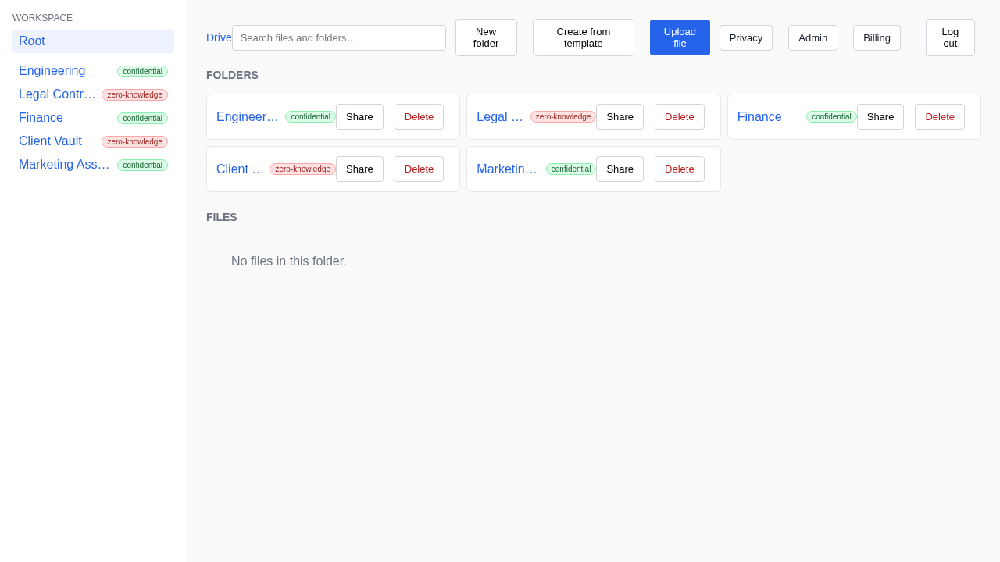
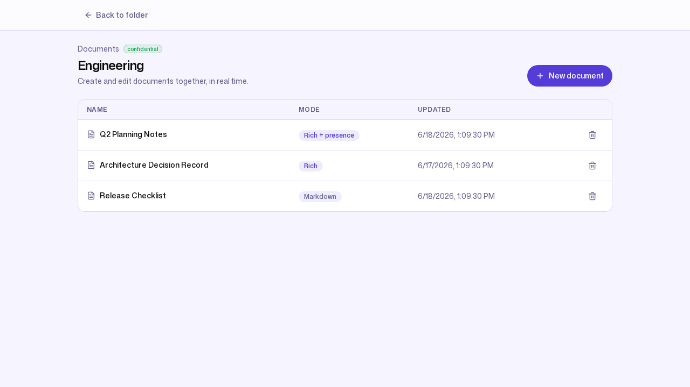
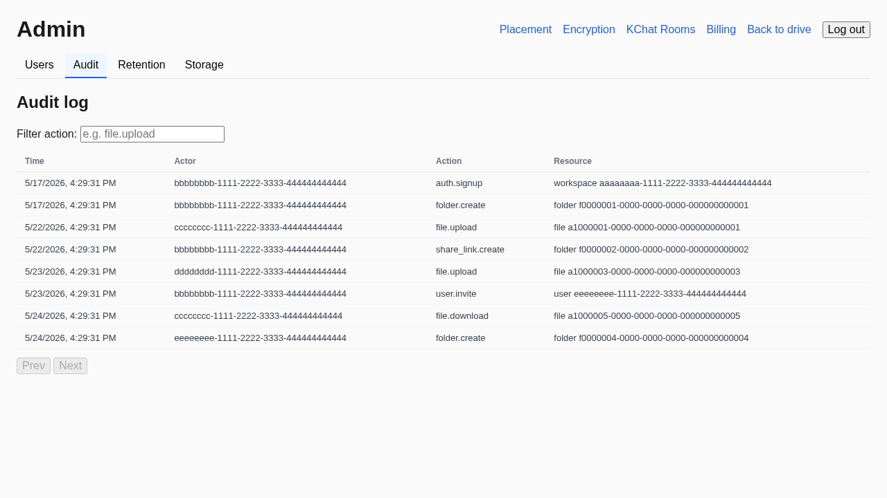
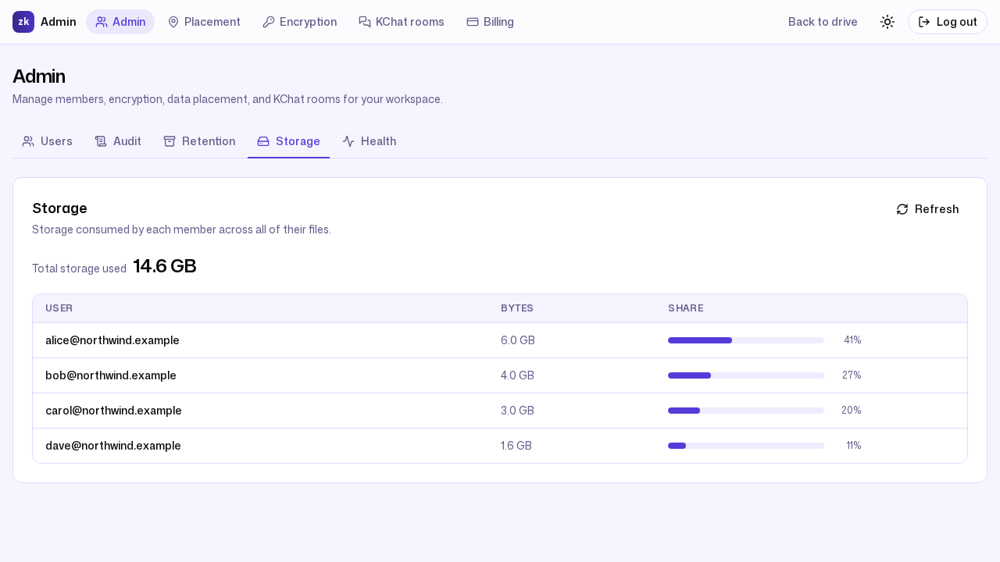

# ZK Drive — Architecture

**License**: Proprietary — All Rights Reserved.

This is the system reference for ZK Drive: how the process topology,
storage split, asynchronous pipeline, privacy modes, collaborative
editor, audit log, API surface, and data model fit together. It is
written for engineers and security-minded evaluators, so capabilities,
limits, and defaults are cited at `path:line` against the code that
implements them.

ZK Drive is a privacy-first, multi-tenant document-management platform
for SMEs and the storage backbone for KChat. Tenants are isolated
**workspaces**; every file lives in a **folder** whose privacy mode
(`managed_encrypted` or `strict_zk`) determines whether the server can
read its bytes. For the product tour and positioning see
[`PRODUCT.md`](PRODUCT.md); for identity and access internals see
[`IAM_CORE.md`](IAM_CORE.md); for the exhaustive configuration-key
table and deployment runbooks see [`CONFIGURATION.md`](CONFIGURATION.md)
and [`OPERATIONS.md`](OPERATIONS.md).

---

## 1. System overview

ZK Drive runs as **two binaries** plus four backing services.

- **`cmd/server`** — one process that serves the HTTP API, the
  WebSocket relays (workspace event hub and per-document collaboration),
  and the static single-page app. The HTTP router is chi, constructed at
  `cmd/server/main.go:1406`; the SPA is served from `STATIC_DIR` when
  set (`cmd/server/main.go:1930-1937`).
- **`cmd/worker`** — a separate process that drains the background job
  queue (preview/thumbnail generation, malware scanning, search
  indexing, cold archiving, retention evaluation, and classification).

The backing services are:

- **PostgreSQL** — all metadata (workspaces, folders, files, documents,
  permissions, sharing, audit log, billing, and so on). An optional read
  replica is used for read-heavy paths (`DATABASE_READ_URL`).
- **S3-compatible object storage** — the file bytes. ZK Drive stores no
  file content in Postgres; bytes flow directly between the client and
  the object-storage gateway over presigned URLs. The gateway
  (zk-object-fabric) exposes the stable S3-compatible contract and, for
  `managed_encrypted` folders, manages the encryption keys.
- **NATS JetStream** — the durable work queue between the server
  (publisher) and the worker (consumers).
- **Redis** — sessions, per-user/per-workspace rate limiting,
  brute-force reputation, and response/tier caches. Most Redis-backed
  features degrade to an in-memory fallback or a no-op when Redis is not
  configured.

```mermaid
flowchart TD
    subgraph Clients
        SPA["Web SPA / PWA"]
        KChat["KChat"]
        Sync["Desktop sync SDK"]
    end

    subgraph Server["cmd/server (one process)"]
        API["chi HTTP API (/api)"]
        WSHub["WS workspace hub (/api/ws)"]
        Collab["WS collab relay<br/>(/api/documents/&#123;id&#125;/ws)"]
        Static["Static SPA (STATIC_DIR)"]
    end

    Worker["cmd/worker<br/>(preview · scan · index ·<br/>archive · retention · classify)"]

    PG[("PostgreSQL<br/>metadata")]
    OBJ[("S3-compatible<br/>object storage")]
    NATS[("NATS JetStream<br/>DRIVE_JOBS")]
    REDIS[("Redis<br/>sessions · limits · cache")]

    SPA --> API
    KChat --> API
    Sync --> API
    SPA -.->|presigned PUT/GET| OBJ
    API --> PG
    API --> REDIS
    API -->|publish| NATS
    NATS -->|consume| Worker
    Worker --> PG
    Worker --> OBJ
    WSHub --- Collab
```

Server replicas are stateless: they share Postgres, Redis, the object
store, and NATS, so the fleet scales horizontally. Cross-replica
concerns (session revocation, rate limiting, collaboration fan-out) are
coordinated through Redis and JetStream rather than in process memory.

---

## 2. The two binaries

### 2.1 Server (`cmd/server`)

The server mounts everything under `/api` on a single chi router
(`cmd/server/main.go:1406`). A request passes through a fixed middleware
spine before reaching a handler:

- `chimw.RealIP` resolves the client IP honoring `TRUSTED_PROXY_DEPTH`
  (`cmd/server/main.go:1418`).
- An OpenTelemetry span wraps the whole request; the access logger sits
  at the `http.Server` handler boundary so it can read the resolved chi
  route pattern after dispatch (`cmd/server/main.go:1939-1959`).
- Authenticated groups add `AuthMiddleware` (built-in JWT) or the
  iam-core middleware, then `TenantGuard`, `SuspensionGuard`,
  `IPAllowlist`, and the rate limiter — in that order
  (`cmd/server/main.go:1738-1750`).

Two long-lived WebSocket endpoints are mounted next to the REST groups
but deliberately **outside** `TenantGuard` and the rate limiter, because
the upgrade handshake breaks `TenantGuard`'s HTTP-method assumptions and
charging per WS frame is the wrong cost model
(`cmd/server/main.go:1684-1735`):

- `GET /api/ws` — the workspace-wide event hub (notifications, the
  desktop-sync change feed broadcast).
- `GET /api/documents/{id}/ws` — the per-document collaboration relay.

### 2.2 Worker (`cmd/worker`)

The worker is the single creator of the JetStream stream and the only
consumer of its subjects. It initializes a preview service, a scan
service (ClamAV), an archive service, a search-index service, and a
classify service when an object-storage client is configured, then
subscribes all consumers (`cmd/worker/main.go`). Preview throughput is
shaped by a per-workspace hourly budget and a tier cache when Redis is
available, so one tenant bulk-uploading cannot starve interactive
previews for everyone else.

Publishing from the server is **fire-and-forget and nil-safe**: handlers
hold a `*jobs.Publisher` and call it unconditionally; when NATS is not
configured the pointer is nil and every publish is a no-op
(`internal/jobs/publisher.go:6-17`). A failed or absent job never blocks
the user-facing upload path.

---

## 3. Storage model and the upload flow

Metadata and bytes are split. Postgres is the source of truth for every
file's identity, location, version history, and privacy mode; the object
store holds only opaque bytes addressed by key. The server never proxies
file content — it mints short-lived presigned URLs and lets the client
talk to the object store directly.

**Upload** is a three-step handshake (`cmd/server/main.go:1784-1786`):

1. `POST /api/files/upload-url` — the server records intent and returns a
   presigned PUT URL for the object store.
2. The client PUTs the bytes straight to the object-storage gateway.
3. `POST /api/files/confirm-upload` — the client tells the server the
   upload landed; the server finalizes the file row and, for
   `managed_encrypted` folders, publishes the post-upload jobs.

Uploads that are requested but never confirmed are tracked so they can be
reconciled rather than leaking object-store keys (orphan-upload tracking,
`migrations/025_orphan_upload_tracking.up.sql`).

**Download and preview** mirror the pattern with presigned GET URLs:
`GET /api/files/{id}/download-url` and `GET /api/files/{id}/preview-url`
(`cmd/server/main.go:1792-1793`). Because URLs are time-limited, the
server guards against handing back a URL that has already expired at the
gateway. Cross-origin embedding of these gateway URLs is allow-listed
through the `SECURITY_HEADERS_CSP_CONNECT_EXTRA` CSP knob.

File version history is first-class: each confirmed upload and each
OnlyOffice save creates a new version, and
`GET /api/files/{id}/versions` lists them
(`cmd/server/main.go:1791`). Retention policy bounds the kept history
(`max_versions`) and ages old content into the cold tier
(`archive_after_days`).

---

## 4. Asynchronous pipeline (NATS JetStream)

Post-upload work runs off the request path on a single JetStream
WorkQueue stream named `DRIVE_JOBS` (`internal/jobs/publisher.go:36-44`).
The publisher and the worker share the subject constants so the two
binaries cannot drift (`internal/jobs/publisher.go:62-72`):

| Subject | Purpose |
| --- | --- |
| `drive.preview.generate` | Preview / thumbnail generation |
| `drive.scan.virus` | Malware scanning (ClamAV, `CLAMAV_ADDRESS`) |
| `drive.search.index` | Full-text search indexing |
| `drive.archive.cold` | Cold-tier archiving of aged content |
| `drive.retention.evaluate` | Retention-policy evaluation |
| `drive.classify.file` | File classification |

Preview generation is split across priority subjects so paid tiers get a
larger share of the worker's goroutine budget; when the heavy-preview
queue is saturated the publisher returns `ErrPreviewDeferred` and the
client shows a "generating…" placeholder rather than failing the upload
(`internal/jobs/publisher.go:46-53`). Preview worker counts and the
per-workspace hourly budget are tunable (`PREVIEW_*` keys); the canonical
table lives in [`CONFIGURATION.md`](CONFIGURATION.md).

These jobs are only published for `managed_encrypted` content. For
`strict_zk` folders the bytes are opaque to the server, so scan, preview,
and indexing have nothing to operate on and are not enqueued (see §5).

---

## 5. Per-folder privacy modes

Privacy is a property of the **folder**, defined at
`internal/folder/folder.go:14-17`:

| Mode | Value | Server can read bytes? | Server-side preview / search / scan |
| --- | --- | --- | --- |
| Managed encrypted | `managed_encrypted` | Yes — gateway manages keys | Enabled |
| Strict zero-knowledge | `strict_zk` | No — ciphertext only | Disabled |

`managed_encrypted` is the default. Bytes are encrypted at rest by the
object-storage gateway, whose keys live on the gateway (optionally
wrapped by a customer-managed KMS key — see §9). Because the server can
obtain plaintext in memory during a request, it can generate previews and
thumbnails, run malware scanning, and build the search index.

`strict_zk` content is encrypted on the client before upload; the server
stores opaque ciphertext and **every server-side processing path is
disabled** for that folder:

- no preview or thumbnail generation,
- no full-text search indexing (strict_zk files do not appear in
  server-side search results),
- no malware scanning,
- no OnlyOffice editing — `GenerateEditorConfig` refuses strict_zk files
  with `ErrStrictZKForbidden` because the Document Server must read and
  write plaintext (`internal/collab/onlyoffice.go:22-25`),
- only the `markdown` collaborative mode is permitted; `rich` and
  `rich_presence` require a managed-encrypted folder (§6).

This is the honest trade-off to state wherever `strict_zk` appears:
`managed_encrypted` is not zero-knowledge (the server can read it), and
`strict_zk` buys client-only confidentiality by giving up every
server-side convenience above.

The workspace default mode is configurable
(`PUT /api/admin/workspace/default-encryption-mode`); changing it is a
privacy-relevant policy change and is recorded in the audit log with the
previous and current modes (`internal/audit/audit.go:48-52`).

---

## 6. Collaborative documents

Documents live inside folders and inherit the parent folder's encryption
mode as their privacy boundary — the document layer never stores its own
mode column (`internal/document/document.go:1-8`). The collaborative
behavior is selected by the document's collab mode
(`internal/document/document.go:25-28`):

| Collab mode | Behavior |
| --- | --- |
| `markdown` | Plain markdown editing; valid under every privacy mode and the default |
| `rich` | Rich text; managed-encrypted folders only |
| `rich_presence` | Live multi-user editing with presence; managed-encrypted only |
| `disabled` | Tombstone when a folder mode change invalidates the prior collab mode |

`rich_presence` is the live experience: a TipTap editor backed by Yjs
CRDT updates, exchanged as binary frames over the per-document WebSocket
relay at `GET /api/documents/{id}/ws` (`cmd/server/main.go:1735`). When
the server runs as multiple replicas, document updates and presence are
fanned out across replicas through Redis so two editors connected to
different replicas see each other.

For office documents (Word/Excel/PowerPoint and their Open Document
equivalents), ZK Drive integrates an external **OnlyOffice Document
Server** (`internal/collab/onlyoffice.go:3-25`):

1. The browser asks for an editor config
   (`GET /api/files/{id}/editor-config`), which embeds a time-limited
   presigned GET URL (the Document Server pulls the bytes), a
   per-version document key, the resolved edit/view permission, and a
   callback URL.
2. On save, the Document Server POSTs
   `POST /api/files/{id}/editor-callback`; the server downloads the
   edited bytes and writes them back as a new file version. That
   callback is authenticated by the OnlyOffice-signed token
   (`ONLYOFFICE_SECRET`) rather than a ZK Drive session, so it is mounted
   outside the auth group (`cmd/server/main.go:1921-1927`).

---

## 7. Audit log (HMAC hash-chained)

Security-relevant events — sign-in/out, SSO link, MFA lifecycle,
permission grant/revoke, admin user management, workspace-settings
changes, retention, billing, webhook subscriptions, and IP-allowlist
changes — are written to an admin-only `audit_log`, distinct from the
user-facing activity stream (`internal/audit/audit.go:1-81`).

Each entry is a link in a per-workspace hash chain that makes tampering
detectable and the log independently verifiable
(`internal/audit/audit.go:98-106`):

- `Seq` — the 1-based position within the workspace.
- `PrevHash` — the previous entry's `EntryHash` (a fixed workspace
  genesis hash for `Seq == 1`).
- `EntryHash` — an HMAC computed over `Seq`, `PrevHash`, and the entry's
  immutable fields.

Because every hash binds the one before it, deleting or editing any row
breaks the chain from that point forward, and a verifier can recompute
the chain end-to-end. The HMAC key is `AUDIT_HMAC_KEY`; when unset it is
HKDF-derived from `JWT_SECRET` under a distinct label, so a fresh install
is self-operating while operators can set a dedicated key (ideally from a
KMS) to keep the chain verifiable across a `JWT_SECRET` rotation and to
ensure a leaked `JWT_SECRET` cannot forge audit history
(`internal/config/config.go:476-482`). The chain fields are read back on
list and cold-archive fetch so archived history stays verifiable.

---

## 8. API surface

Everything is mounted under `/api` on the chi router
(`cmd/server/main.go:1406`). Groups differ by their middleware spine;
each is backed by a handler package under `api/` or `internal/`.

| Group | Representative routes | Middleware spine |
| --- | --- | --- |
| Public | `GET /config`, `/setup/*`, `GET/POST /share-links/{token}`, `GET /guest-invites/{id}/preview`, `POST /webhooks/stripe`, `POST /files/{id}/editor-callback` | None (each route authenticates itself where needed) |
| Auth | `/auth/signup`, `/auth/login`, `/auth/oauth/*`, `/auth/logout`, `/auth/refresh`, `/auth/sessions`, `/auth/totp/*` | Mixed (see [`IAM_CORE.md`](IAM_CORE.md)) |
| Realtime | `GET /ws`, `GET /documents/{id}/ws` | Auth + SuspensionGuard + IPAllowlist (no TenantGuard / rate limiter) |
| Data plane | `/me`, `/features`, `/workspaces`, `/folders`, `/documents`, `/files` (+ `upload-url`, `confirm-upload`, `download-url`, `preview-url`, `editor-config`, `versions`, `tags`), `/bulk/*`, `/permissions`, `/share-links`, `/guest-invites`, `/client-rooms` (+ `templates`, `from-template`), `/search` (+ `expand`), `/notifications`, `/push/*`, `/activity`, `/changes` | Auth + TenantGuard + SuspensionGuard + IPAllowlist + rate limiter |
| Admin | `/admin/*` (users, audit, retention, storage, health, placement, cmk, billing/plan) + `/admin/webhooks` | Data-plane spine + `AdminOnly` |
| KChat | `/kchat/*` (room mappings auto-provision a backing folder) | Data-plane spine |
| Platform | `/platform/*` | `PlatformAuth` (a `pk_` API key) + per-IP rate limiter — fleet-wide, outside the workspace JWT / tenant chain |

Notable design choices visible in the router:

- The data plane and the realtime upgrades both run `SuspensionGuard` and
  `IPAllowlist`, so a suspended or network-blocked workspace cannot keep
  realtime sync alive after its REST calls start failing
  (`cmd/server/main.go:1700-1714`).
- `IPAllowlist` is mounted on the data plane but **not** on `/admin`, so
  an admin who misconfigures the allowlist can still reach the management
  endpoints to fix it (`cmd/server/main.go:1742-1749`).
- Public share-link resolution (`/share-links/{token}`) and the
  guest-invite preview sit outside the auth group on purpose — anyone
  holding the token/UUID can resolve them, with password, expiry, and
  download-cap checks enforced in the sharing service
  (`cmd/server/main.go:1901-1913`).
- The platform control plane runs a per-client-IP rate limiter *before*
  auth as defense-in-depth, since there is no JWT to key the normal
  limiter on (`cmd/server/main.go:1885-1898`).

---

## 9. Data model

Postgres holds the entire metadata model. The schema is defined by the
ordered SQL files under `migrations/`; the table groups below map each
concept to where it is defined.

| Domain | Core tables | Defined in |
| --- | --- | --- |
| Identity & tenancy | `workspaces`, `users` | `migrations/001_initial_schema.up.sql` |
| Folder tree | `folders` (self-referential `parent_folder_id`, `encryption_mode`) | `migrations/002_folders.up.sql`, `migrations/018_folder_encryption_mode.up.sql` |
| Files & content | `files`, file versions, previews, scan status, tags, classification | `migrations/003_files.up.sql`, `007`, `008`, `015`, `022` |
| Collaborative docs | `documents` (+ snapshot/deltas), `collab_mode` | `migrations/030_collab_documents.up.sql` |
| Sharing | share links, guest invites | `migrations/005_sharing.up.sql` |
| Client rooms | client rooms + templates | `migrations/006_client_rooms.up.sql` |
| Access & activity | permissions (ACL grants), activity log | `migrations/004_permissions_activity.up.sql` |
| Audit & retention | `audit_log` (hash-chained), retention policies, archive runs | `migrations/011`, `012`, `013`, `027` |
| Billing | workspace plans, Stripe customer id | `migrations/016`, `023` |
| Storage & keys | per-workspace storage credentials, customer-managed keys | `migrations/017`, `020` |
| KChat | KChat room mappings | `migrations/021_kchat_rooms.up.sql` |
| Federation | `iam_core_tenant_workspaces` | `migrations/039_iam_core_tenant_workspaces.up.sql` |
| Auth hardening | TOTP credentials, asymmetric JWT signing keys, IP allowlist | `migrations/026`, `034`, `035` |

Key structural facts:

- **Folders** form a tree per workspace; a nil `parent_folder_id` is a
  root folder, and `encryption_mode` is the privacy boundary inherited by
  every file and document inside (`internal/folder/folder.go:30-43`).
- **Documents** never store their own encryption mode; they inherit it
  from the parent folder (`internal/document/document.go:1-8`).
- **Guest invites** are modeled on a folder; inviting on a file grants
  access to its parent folder.
- **Tenant isolation is enforced in the database.** Postgres row-level
  security scopes rows to the active workspace
  (`migrations/024_row_level_security.up.sql`); `TenantGuard` binds the
  workspace from the authenticated identity into the request context and
  the RLS session variable, so a query can only ever see its own
  workspace's rows. High-volume tables are partitioned
  (`migrations/033_partition_large_tables.up.sql`).
- **Customer-managed keys (CMK)** let a workspace point the gateway at
  its own KMS key (`PUT /api/admin/cmk`,
  `migrations/020_workspace_cmk.up.sql`) so it can wrap and revoke its
  files' data keys.

---

## 10. Request lifecycle and tenant isolation

A typical authenticated data-plane request:

1. **Edge** — `RealIP` resolves the client address; an OpenTelemetry
   span opens and the access logger records the resolved route after
   dispatch.
2. **Authentication** — either the built-in JWT `AuthMiddleware` or the
   iam-core middleware verifies the bearer token and binds
   `(workspaceID, userID, role)` into the context. Both paths produce the
   identical context shape, so everything downstream is auth-mode
   agnostic ([`IAM_CORE.md`](IAM_CORE.md)).
3. **Tenant guard** — binds the workspace into the Postgres RLS session
   variable; subsequent queries are physically constrained to that
   workspace.
4. **Suspension & conditional access** — `SuspensionGuard` returns 503
   for a suspended workspace; `IPAllowlist` enforces per-workspace CIDR
   rules when enabled.
5. **Rate limiting** — a per-user and per-workspace limiter (Redis-backed
   with an in-memory fallback) bounds request volume.
6. **Handler** — reads/writes Postgres, mints presigned URLs against the
   object store, and publishes JetStream jobs as needed.

Sessions are device-bound: a fingerprint of the User-Agent and IP network
prefix is captured at sign-in and re-checked on every request, so a
stolen bearer token replayed from another browser or network forces
re-authentication. The session, rate-limit, brute-force, and JWT details
live in [`IAM_CORE.md`](IAM_CORE.md).

---

## 11. Deployment topology

ZK Drive is configured entirely through environment variables read in
`internal/config/config.go`; the required core keys are `DATABASE_URL`
and `JWT_SECRET`, plus the S3 group for object storage. The high-traffic
keys are summarized below and documented exhaustively in
[`CONFIGURATION.md`](CONFIGURATION.md).

- **Core**: `DATABASE_URL`, `DATABASE_READ_URL`, `JWT_SECRET`,
  `JWT_ALGORITHM`, `STATIC_DIR`, `LISTEN_ADDR`.
- **Object storage**: `S3_ENDPOINT`, `S3_BUCKET`, `S3_ACCESS_KEY`,
  `S3_SECRET_KEY`.
- **Jobs / scanning**: `NATS_URL`, `CLAMAV_ADDRESS`, `PREVIEW_*`.
- **Auth hardening**: `RATE_LIMIT_PER_USER`, `RATE_LIMIT_PER_WORKSPACE`,
  `AUTH_FAILURE_THRESHOLD`, `AUTH_BLOCK_DURATION`, `TRUSTED_PROXY_DEPTH`.
- **Audit**: `AUDIT_HMAC_KEY`.

Operationally:

- **Server replicas** are stateless and horizontally scalable; they share
  Postgres, Redis, the object store, and NATS. A workspace event hub and
  collaboration relay span replicas through Redis.
- **Worker replicas** scale independently; JetStream's WorkQueue
  semantics distribute jobs across them, and the per-workspace preview
  budget keeps any single tenant from monopolizing the fleet.
- **External WS proxy mode** is supported: when an external realtime tier
  (for example Centrifugo/Pusher) terminates client sockets, the server's
  `/api/ws` upgrade responds 501 so a client still dialing the API
  directly fails loudly instead of opening a dead socket
  (`cmd/server/main.go:1715-1726`).
- **Static SPA** is served from `STATIC_DIR` by the same process when set,
  so a minimal deployment is a single server binary plus Postgres, Redis,
  object storage, and NATS.

For first-run setup the SPA walks an admin through the
[`setup wizard`](screenshots/18-setup-wizard.png) (`/api/setup/*`), which
validates storage connectivity before completing.
