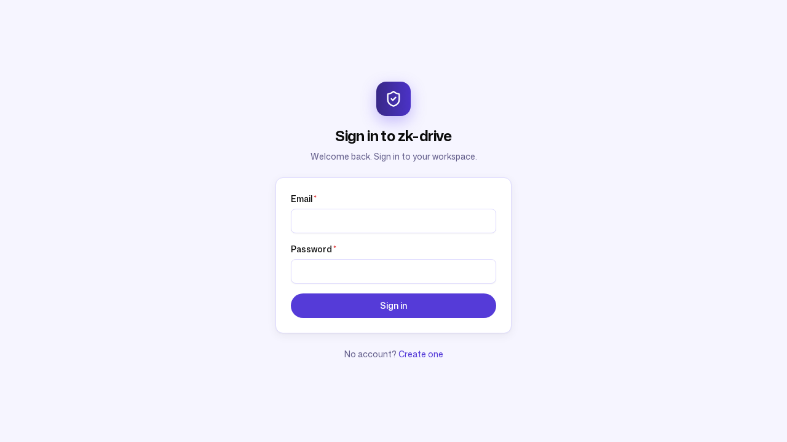
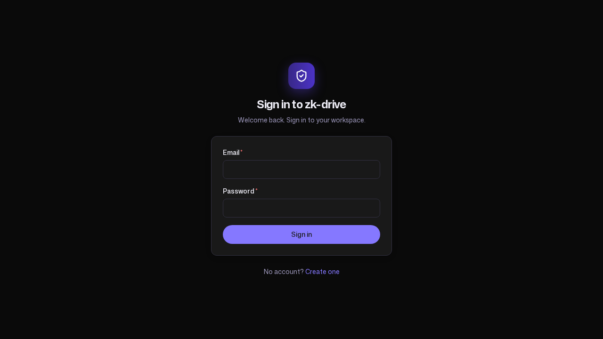
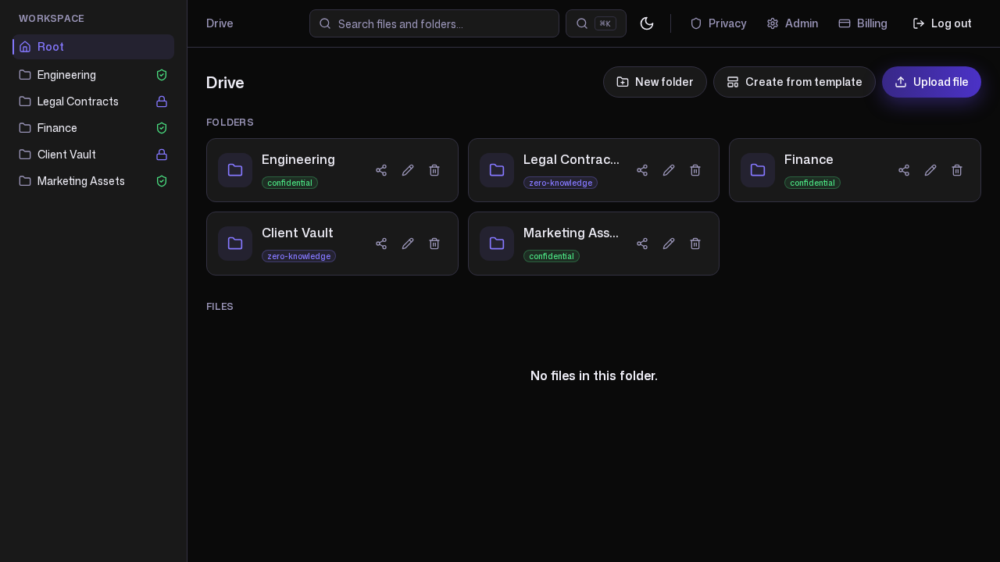

# zk-drive — brand and writing guide

This guide defines how zk-drive looks and how it is written, so every surface —
the product UI, this documentation, and the blog — stays consistent. The visual
system is the KChat look and feel, defined once as design tokens in
`frontend/src/index.css` and consumed everywhere through Tailwind
(`frontend/tailwind.config.js`). The writing rules come from
[`FACTS_AND_VOICE.md`](FACTS_AND_VOICE.md) §2 and §9.

---

## 1. Product naming

- **zk-drive** — lowercase, hyphenated, in body text and headings. It is the
  name the product shows users (the sign-in screen reads "Sign in to
  zk-drive"). Start a sentence with it lowercase rather than capitalizing it.
- **KChat** — the separate team-chat product that uses zk-drive as its storage
  backbone. Capital K, capital C. The dependency is one-directional: KChat
  depends on zk-drive; zk-drive ships and runs without KChat.
- **zk** stands for **zero-knowledge**, a capability the product offers at the
  folder level — not a claim about every file. Never expand it in a way that
  implies the whole platform is zero-knowledge.

Refer to the privacy modes by the names in §4. Refer to roles as `member`,
`admin`, and `owner-admin`.

---

## 2. Visual system

The palette is an indigo/violet brand on lavender-tinted light surfaces and
near-black dark surfaces. Every color is a token; components never hard-code
hex values, so the entire app — including inline-styled components — themes
from one source.

### Brand and accent colors

| Token | Light | Dark | Use |
| --- | --- | --- | --- |
| `brand` | `#553BD8` | `#8578FF` | Primary call-to-action, active states |
| `brand-hover` | `#4B32C7` | `#9A8EFF` | Hover state of the primary action |
| `accent` | `#6549F2` | `#8578FF` | Gradients, glows, focus ring |
| `accent-2` | `#8578FF` | `#BAB2FF` | Secondary accent / lavender highlight |

The lighter brand (`#8578FF`) carries the primary action on dark surfaces so it
stays legible against near-black.

### Surfaces and text

| Token | Light | Dark |
| --- | --- | --- |
| `bg` (app background) | `#F6F5FF` | `#0A0A0A` |
| `surface` (cards, panels) | `#FFFFFF` | `#191919` |
| `surface-2` (hover / subtle fill) | `#EEECFF` | `#252430` |
| `border` (hairlines) | `#DDD9FF` | `#333142` |
| `fg` (primary text) | `#0A0A0A` | `#EDECF5` |
| `muted` (secondary text) | `#645F8C` | `#9A95B8` |

`#191919` is the KChat dark surface. Contrast pairs are chosen to meet the
WCAG AA 4.5:1 ratio for normal text in both themes; the muted text on the
light lavender surface is darkened to `#645F8C` to stay AA.

### Gradients and glows

The signature KChat violet gradients are named background utilities so
components reference one source rather than re-deriving stops:

- `brand-gradient` — `linear-gradient(90deg, #382887 0%, #4B32C7 100%)`
- `brand-gradient-soft` — `linear-gradient(180deg, #8578FF 0%, #6549F2 100%)`
- `brand-glow` — a radial violet glow fading from `#6549F2` to `#191919`

### Typography

- **Mona Sans** — the primary UI typeface (`font-sans`).
- **Sono** — the monospace accent for code, hashes, and identifiers
  (`font-mono`).

Both are self-hosted variable fonts (a single file spans the weight range)
under the SIL Open Font License 1.1, served from the app rather than a CDN so
the product stays fully offline/PWA-capable and leaks no requests to a third
party — fitting for a privacy-first product.

### Shape and components

- **Buttons are fully-rounded pills** (`rounded-full`) at medium weight.
- **Cards and panels** use a 12px `rounded-card` radius with a soft shadow.
- **Full light and dark theming** is driven by a `.dark` class on `<html>`
  that flips the token values; nothing about the layout changes between themes.

---

## 3. Encryption badges

The folder privacy mode shows as a small badge with a consistent color and
icon so it is recognizable at a glance:

- **Confidential managed** (`managed_encrypted`) — success green with a shield
  icon. Short label: "confidential."
- **Strict zero-knowledge** (`strict_zk`) — brand indigo with a lock icon.
  Short label: "zero-knowledge."

Every badge links to the in-product privacy page, the canonical explainer of
what each mode enables and disables, so the trade-off is always one click away.

---

## 4. Voice and terminology

The voice is plain, operator-grade language for an SME admin or knowledge
worker with no training and no dedicated ops team. Lead with the job to be
done; prefer concrete steps and real numbers over adjectives.

### Five rules

1. **One current truth — present tense.** Describe what the product *is*, as
   if it has always worked this way. Do not frame anything as a stage,
   release, or change over time.
2. **Code-verified only.** Every capability, limit, default, and endpoint
   traces to source. No aspirational features.
3. **Honesty is a brand asset.** Never imply `managed_encrypted` folders are
   zero-knowledge. Always state plainly that `strict_zk` disables server-side
   preview, search, and malware scanning. Keep the candid competitive framing
   and the honest "not provisioned here" callouts.
4. **Plain language.** Short sentences, real names and numbers, no jargon for
   its own sake.
5. **Consistent terminology.** The same word for the same concept everywhere
   (see the table below).

### Terminology

| Use | Avoid |
| --- | --- |
| `managed_encrypted` / Confidential managed | "encrypted", "normal", "standard" |
| `strict_zk` / strict zero-knowledge | "private mode", "secure mode" |
| workspace | "tenant" (in customer-facing copy), "org" |
| member · admin · owner-admin | "user" for a role, "superadmin" |
| share link · guest invite · client room | "public link", "external user" |
| object storage / object-storage gateway | naming a specific vendor as the product |

### Words to never use

Avoid every form of time-framing. Do not label a feature by a stage or a
release number, do not describe the product as changing over time, and do not
point to superseded behavior or unbuilt future plans. The product has one
current truth; write it in the present tense.
[`FACTS_AND_VOICE.md`](FACTS_AND_VOICE.md) §2 enumerates the exact words to
avoid — treat that list as the authority.

### The demo workspace

Ground every example in the canonical demo workspace, **Northwind Trading**,
and use **Lakeside Legal** for isolation examples. The exact members, folders,
files, and numbers are in [`FACTS_AND_VOICE.md`](FACTS_AND_VOICE.md) §7. The
demo password where it must be shown is `DemoPass!2026`.

---

## 5. Where this comes from

- Visual tokens: `frontend/src/index.css`, `frontend/tailwind.config.js`.
- Button and badge components: `frontend/src/components/ui/`,
  `frontend/src/components/EncryptionBadge.tsx`.
- Voice, terminology, and the demo narrative:
  [`FACTS_AND_VOICE.md`](FACTS_AND_VOICE.md) §2, §6, §7, §9.
- Capability reference: [`PRODUCT.md`](PRODUCT.md).
