# zk-drive — product reference

This is the definitive reference for what zk-drive does and who it is for. It
covers the per-folder privacy modes, collaborative documents, sharing and
external access, security and account protection, administration and
governance, and the billing tiers exactly as the product enforces them.

Every capability below traces to the code. For the system design, data model,
and API internals, see [`ARCHITECTURE.md`](ARCHITECTURE.md); for identity and
single sign-on, [`IAM_CORE.md`](IAM_CORE.md). The writing and naming rules are
in [`BRAND.md`](BRAND.md). Examples use the canonical demo workspace,
**Northwind Trading**, an import and distribution SME.

---

## 1. What zk-drive is

zk-drive is a privacy-first, multi-tenant secure document-management platform
for small and mid-sized teams. It gives a workspace a familiar drive —
folders, files, versions, previews, search, and sharing — that the team can
run with **no training and no dedicated ops**. It is an alternative to Google
Drive, Dropbox, and OneDrive for organizations that need to control who can
read their data and where it is stored.

It serves two audiences from one codebase:

- **SME teams, agencies, consultancies, and professional-services firms** that
  want secure internal storage, governed external collaboration, data
  residency, and a clear audit trail — without enterprise complexity.
- **KChat**, the team-chat product, which uses zk-drive as its storage
  backbone (see §10).

zk-drive owns the application layer — workspaces, members, folders,
permissions, sharing, retention, previews, search, and the admin surface. File
bytes live in an S3-compatible object-storage gateway, and metadata lives in
PostgreSQL.

---

## 2. The honest positioning

zk-drive earns trust by being candid about trade-offs rather than overselling.
Two points define the positioning:

- **It is not "everything is zero-knowledge."** Most mainstream drives can
  read customer files; most zero-knowledge tools give up previews, search, and
  collaboration to avoid that. zk-drive lets each **folder** pick the right
  trade-off, and labels that choice plainly.
- **Storage, previews, and account protection are real, finite features.**
  The product describes what it does today, with concrete limits and the exact
  features each privacy mode turns off — never aspirational capability.

This candor is a brand asset. The phrasing rules that keep it consistent live
in [`BRAND.md`](BRAND.md).

---

## 3. Per-folder privacy modes (the core differentiator)

Each folder carries one encryption mode, chosen when the folder is created and
stored on the folder record (`internal/folder/folder.go:14-17`):

| Mode (folder value) | In-product label | Server can read contents? | Preview · search · malware scan |
| --- | --- | --- | --- |
| `managed_encrypted` (default) | Confidential managed | Yes — the gateway manages the keys | Enabled |
| `strict_zk` | Strict zero-knowledge | No — ciphertext only | Disabled |

**`managed_encrypted`** is the default. Content is encrypted at rest, and the
gateway can decrypt it during request handling, which is what powers preview
and thumbnail generation, malware scanning, and the full-text search index.
This is the right default for everyday work — and it is **not** zero-knowledge,
so the product never calls it that.

**`strict_zk`** encrypts content on the client. The server stores opaque
ciphertext and **every server-side processing path is disabled**: no previews,
no full-text search of contents, and no malware scanning for that folder.
That is the deliberate trade-off, and the folder-creation dialog states it
before you commit.

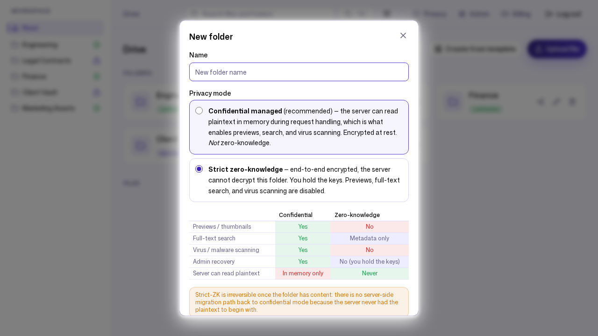

The two modes can coexist in one workspace. At Northwind Trading, `Engineering`,
`Finance`, and `Marketing Assets` are `managed_encrypted`, while
`Legal Contracts` and `Client Vault` are `strict_zk`. The workspace-wide
default mode is configurable by an admin
(`PUT /api/admin/workspace/default-encryption-mode`); Northwind keeps the
default at `managed_encrypted`.

The in-product privacy page is the canonical explainer of this trade-off, and
the encryption badge on every folder links to it.

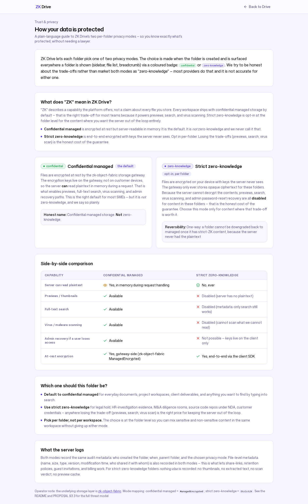

---

## 4. Collaborative documents

A folder can hold collaborative documents whose collab mode is one of
`markdown`, `rich`, `rich_presence`, or `disabled`
(`internal/document/document.go:25-28`):

- **`rich_presence`** is the live multi-user editing experience — a TipTap
  editor synchronized with Yjs over the WebSocket relay, with presence
  indicators showing who else is in the document.
- **`markdown`** and **`rich`** cover single-stream editing.
- **OnlyOffice** is a supported editor integration for office formats
  (`internal/collab/onlyoffice.go`).

A document inherits its folder's privacy mode as its boundary; the richer
collaborative modes are available in `managed_encrypted` folders. At Northwind
Trading, the team keeps a live `rich_presence` document, **"Q2 Planning
Notes,"** in the `Engineering` folder.

---

## 5. Sharing and external access

zk-drive covers collaboration inside the team and with outside parties.

- **Share links** (`POST /api/share-links`) work on both files and folders and
  support an optional password, an expiry (`expires_at`), and a download cap
  (`max_downloads`). Northwind's link on `architecture-overview.pdf` in
  `Engineering` carries a password, expires on 2026-12-31, and is capped at 25
  downloads; a separate viewer link is shared on the `Marketing Assets`
  folder.
- **Guest invites** (`POST /api/guest-invites`) bring an external
  collaborator into a specific folder. Inviting on a file grants access to its
  parent folder. Northwind invites `client@brightwave-partners.example` as a
  viewer into its `Client Vault`.
- **Client rooms** are provisioned from templates
  (`POST /api/client-rooms/from-template`) to set up a ready-made external
  collaboration space — Northwind spins up a **"Brightwave Partners"** room.

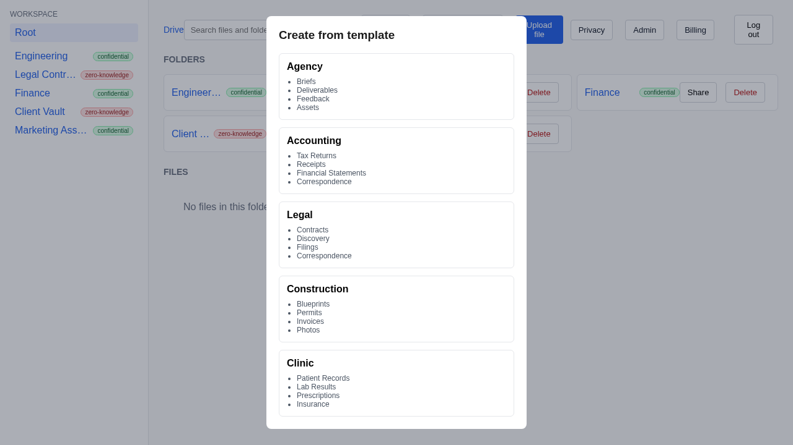

---

## 6. Security and account protection

- **Two-factor authentication** uses TOTP (`/api/auth/totp/...`,
  `internal/totp`). Enrollment shows a QR code alongside a manual secret so a
  member can register an authenticator app.
- **Single sign-on** is wired for Google, Microsoft, and an IAM Core OIDC
  provider (`internal/config/config.go`; see [`IAM_CORE.md`](IAM_CORE.md)).
- **Rate limiting and auth-failure blocking** are configurable to slow
  credential-stuffing and abuse; see the keys in
  [`CONFIGURATION.md`](CONFIGURATION.md).
- **Tenant isolation** keeps every workspace's data fully separate. Lakeside
  Legal, the demo's second workspace, exists precisely to demonstrate that one
  tenant can never see another's folders or files.

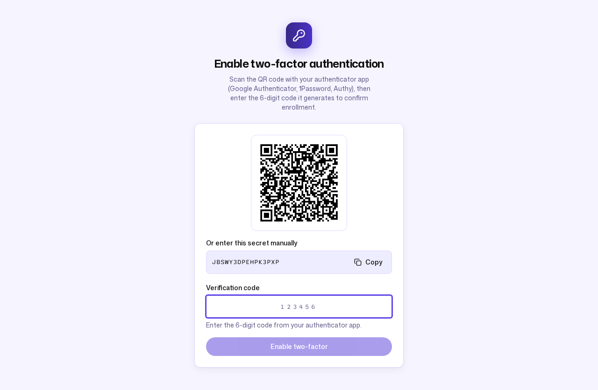

---

## 7. Administration and governance

The admin console (`/api/admin/...`) gives a workspace owner-admin everything
needed to run the team:

- **Members.** Invite people, assign the `admin` or `member` role
  (`internal/user/user.go:11-12`), and deactivate accounts. Invited members
  set their own password on first sign-in. Northwind has owner-admin Alice
  Chen, admin Dave Patel, active members Bob Martinez and Carol Nguyen, and a
  deactivated account for Eve Thompson.
- **Audit log.** A tamper-evident, HMAC hash-chained record of
  security-relevant events; each entry references the previous entry's hash so
  the chain is independently verifiable (`internal/audit/audit.go:98-107`).
- **Retention policies.** Set `max_versions` and `archive_after_days` as a
  workspace default or per folder. Northwind keeps 10 versions and archives
  after 365 days by default, and raises `Legal Contracts` to 25 versions.
- **Storage usage** and a **health dashboard** report consumption and system
  state.
- **Data placement.** Pin where data is stored by `provider`, `region`,
  `country`, and `storage_class`. Northwind uses provider `aws`, region
  `us-east-1`, country `US`, storage class `STANDARD`.
- **Customer-managed keys (CMK).** Bring your own key
  (`PUT /api/admin/cmk`); Northwind registers a KMS key ARN.
- **Outbound webhooks** (`POST /api/admin/webhooks`) notify an external
  endpoint per event type — Northwind subscribes to `file.upload.confirmed`.
- **KChat room mappings** (`POST /api/kchat/rooms`) auto-provision a backing
  folder for a chat room (see §10).

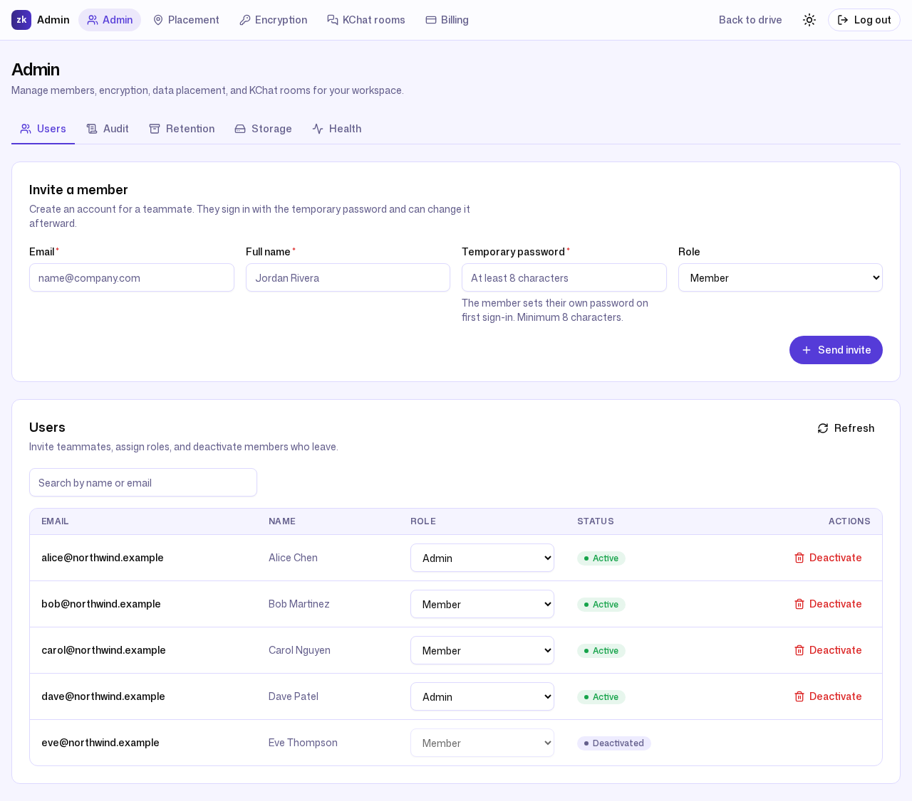

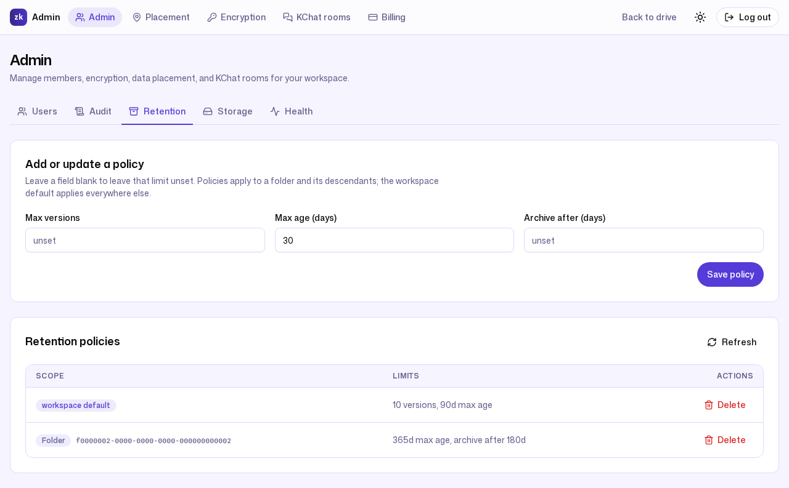

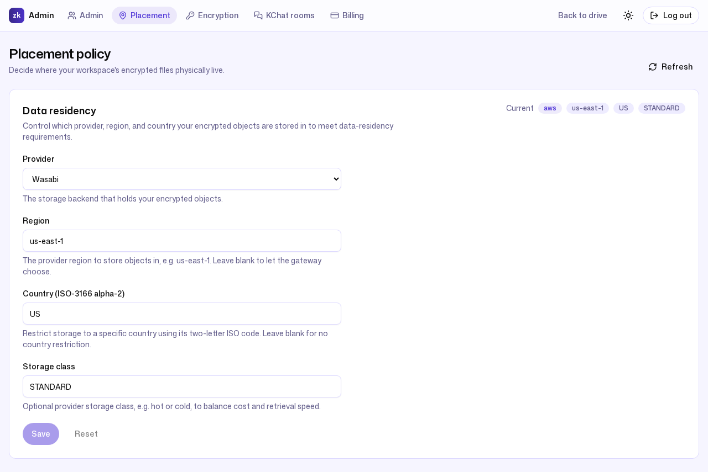

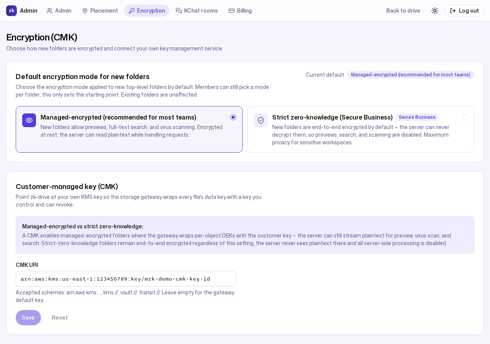

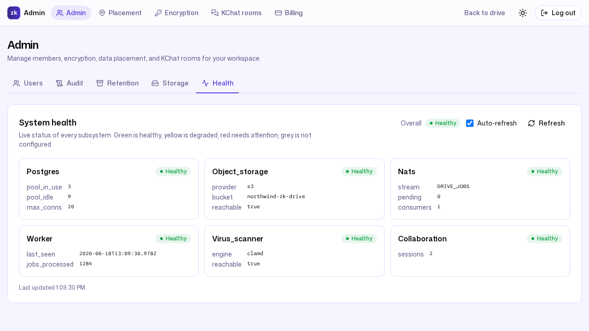

---

## 8. Billing tiers

Plans are stored per workspace; usage is enforced before any
storage-, user-, or bandwidth-consuming operation. The tier identifiers are
the canonical strings used by both the API and the UI
(`internal/billing/billing.go:24-120`):

| Tier (`value`) | Storage | Users | Bandwidth / month |
| --- | --- | --- | --- |
| Free (`free`) | 5 GB | 5 | 10 GB |
| Starter (`starter`) | 250 GB | 25 | 100 GB |
| Business (`business`) | 1 TB | 250 | 1 TB |
| Secure Business (`secure_business`) | 5 TB | 1000 | 5 TB |

- A workspace plan row can override any of these defaults with explicit
  limits; where an override is unset, the tier default applies.
- A workspace with **no plan row falls back to the Free defaults.**
- An operation that would push a workspace past its storage, user, or
  bandwidth limit returns **402 Payment Required**
  (`ErrQuotaExceeded`, `internal/billing/billing.go:44-48`), so the client can
  prompt for an upgrade.

Northwind Trading is on the `business` tier with explicit overrides — 1 TB of
storage, 50 users, and 5 TB of monthly bandwidth.

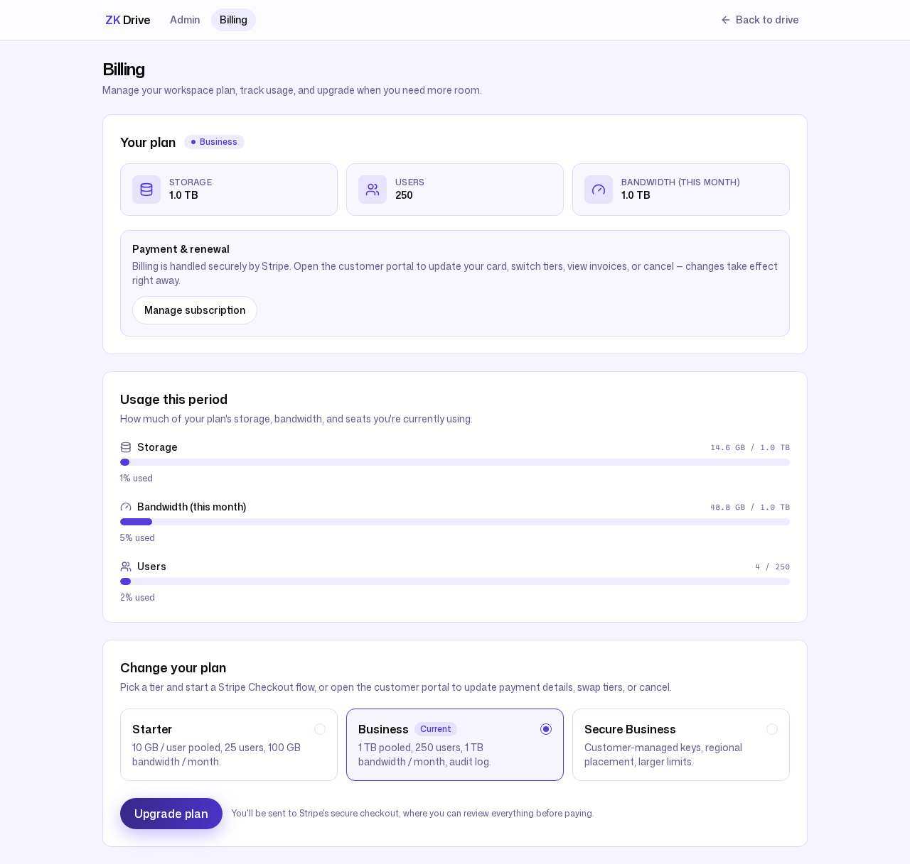

---

## 9. Clients

zk-drive meets a team on whatever device it uses:

- **Web** — a React + TypeScript app, installable as a PWA.
- **Mobile** — native iOS (Swift / SwiftUI) and native Android (Kotlin /
  Jetpack Compose) apps over a shared Rust bridge. See
  [`MOBILE_IOS.md`](MOBILE_IOS.md), [`ANDROID_APP.md`](ANDROID_APP.md), and
  [`MOBILE_BRIDGE.md`](MOBILE_BRIDGE.md).
- **Desktop** — a Tauri sync client built on the Rust client SDK. See
  [`../desktop/README.md`](../desktop/README.md) and
  [`../sdk/README.md`](../sdk/README.md).

---

## 10. KChat integration

KChat is a separate team-chat product that uses zk-drive as its file layer.
The dependency runs one way: KChat depends on zk-drive, and zk-drive ships and
runs as a standalone product without KChat.

The integration is small and explicit. A KChat room maps to a zk-drive folder:
creating a room mapping (`POST /api/kchat/rooms`) auto-provisions the backing
folder, and chat attachments become files in it — scanned, previewed, and
governed by the same retention and privacy rules as any other folder.

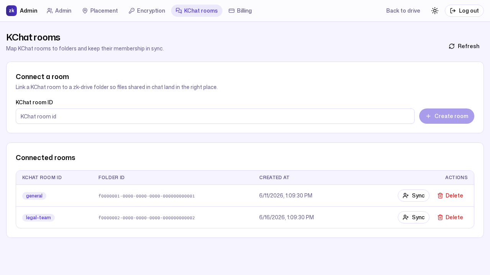

---

## 11. What zk-drive does not do

Being clear about non-goals is part of the honest positioning:

- **It is not an office suite.** zk-drive provides collaborative documents and
  integrates OnlyOffice for office formats rather than building its own Docs,
  Sheets, and Slides.
- **It does not promise "unlimited storage."** Every tier states concrete
  storage, user, and bandwidth limits, and an over-limit operation returns
  402 rather than silently degrading.
- **It does not read `strict_zk` content.** For zero-knowledge folders there
  is no server-side preview, search, malware scan, or admin content recovery —
  by design.

---

## 12. Where to go next

- [`BRAND.md`](BRAND.md) — visual design language, product naming, and
  terminology rules.
- [`ARCHITECTURE.md`](ARCHITECTURE.md) and [`IAM_CORE.md`](IAM_CORE.md) —
  system architecture and identity.
- [`CONFIGURATION.md`](CONFIGURATION.md), [`OPERATIONS.md`](OPERATIONS.md),
  [`DEVELOPMENT.md`](DEVELOPMENT.md) — configure, operate, and develop.
- [`blog/README.md`](blog/README.md) — guided walkthroughs and evidence,
  grounded in the demo workspace.
- [`FACTS_AND_VOICE.md`](FACTS_AND_VOICE.md) — the code-verified fact sheet and
  the demo narrative behind every example here.
