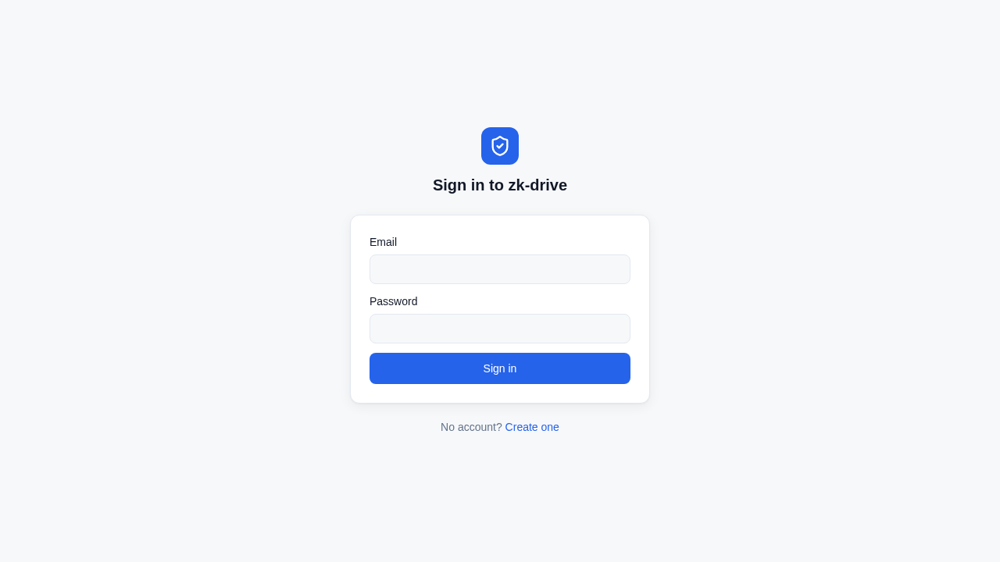
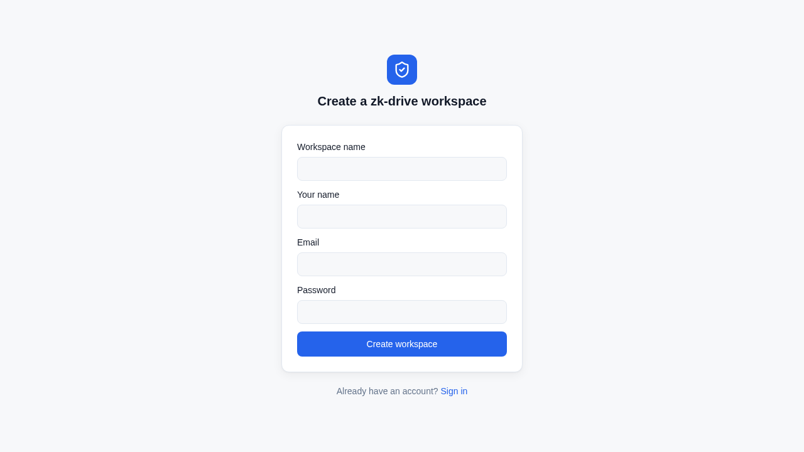
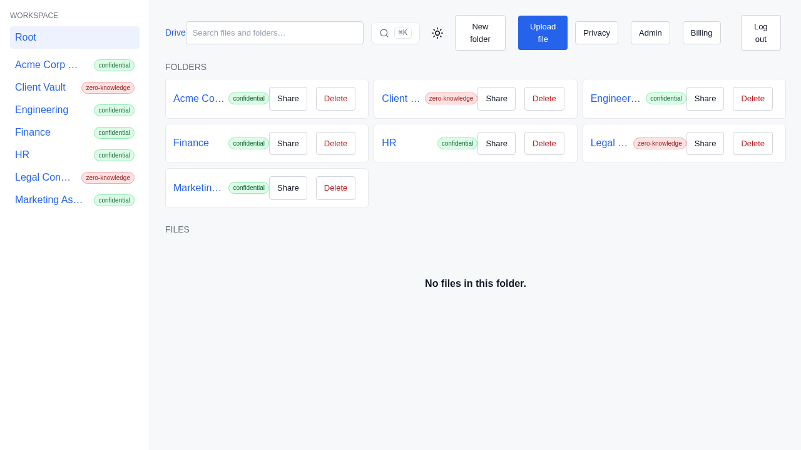
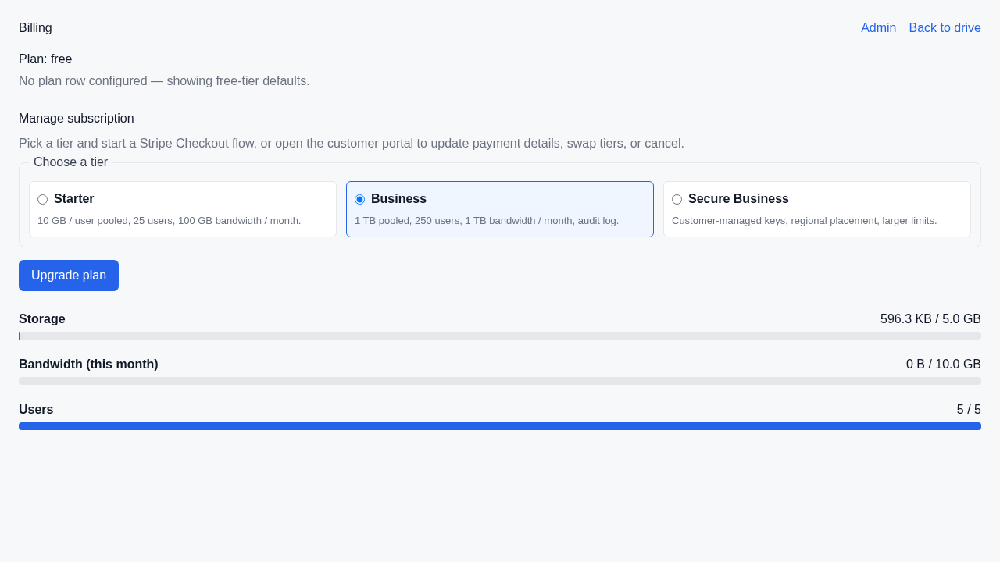

# 1. Standing up a workspace

**Persona:** Admin / IT lead at an SME
**Job to be done:** *"Get my team onto secure, governed file storage in
minutes — without standing up infrastructure or reading a manual."*

---

Alice runs operations at Northwind Trading. She does not have a dedicated IT
department, and she is not going to file a ticket to provision storage. She
needs to sign in, invite four colleagues, lay out a folder structure, and be
confident the sensitive folders are actually protected — all before lunch.

## Signing in

ZK Drive opens on a single, uncluttered sign-in screen. There is no tenant
picker, no "contact sales", no eight-field enterprise SSO wizard in the way of
a small team getting started.



Self-serve signup is one click away, so a brand-new workspace owner is never
blocked on an administrator who does not exist yet.



## Inviting the team

From **Admin → Users**, Alice invites her colleagues with a role on each
invite. The roster below is the real seeded team: Alice and Carol as **Admin**,
Bob, Dan, and Erin as **Member**. Roles are editable inline, and any account
can be deactivated in one click — the controls an SME admin actually uses,
without the sprawl of an enterprise IAM console.


Every invitation is recorded. Here are the four real invite events pulled
straight from the audit log (more on that in
[post 5](05-compliance-and-security.md)):

```
admin.user_invite | role=member | email=bob@northwind.example
admin.user_invite | role=admin  | email=carol@northwind.example
admin.user_invite | role=member | email=dan@northwind.example
admin.user_invite | role=member | email=erin@northwind.example
```

## Laying out folders — with protection as a first-class choice

When Alice creates a folder, ZK Drive asks the one question most file products
bury in settings: **how should this folder be protected?** The choice is made
up front, in plain language, with the trade-offs shown side by side.


This is the heart of ZK Drive's design and it gets its own
[dedicated post](04-privacy-and-zero-knowledge.md). For onboarding, the point
is simply that Alice does not need to understand key management to make a safe
choice — the default ("Confidential managed") is right for most folders, and
the strong option ("Strict zero-knowledge") is one radio button away with its
costs spelled out honestly, including the irreversibility warning.

A few minutes later Northwind's workspace looks like this — a normal-feeling
drive where every folder wears its protection level as a colored badge:



`Engineering`, `Finance`, `HR`, and `Marketing Assets` are everyday confidential
storage (green). `Legal Contracts` and `Client Vault` are zero-knowledge (red).
The badge is not decoration — hovering it explains exactly what the server can
and cannot do with that folder's contents.

Once the team starts working, a folder fills with real documents — here is
`Engineering` with nested sub-folders and uploaded files, each showing type,
size, modified time, and per-file actions:


## Knowing what it costs

The **Billing** page shows real, pooled usage — not a per-seat cap that punishes
the one person who uploads a lot. After seeding, Northwind shows 596 KB used
against the workspace pool, 5 of 5 seats filled, and three clearly-described
tiers (Starter, Business, Secure Business) with an obvious upgrade path.



Pooled storage and transparent metering are deliberate: ZK Drive inherits a
real, published storage cost curve rather than promising "unlimited" and hiding
egress fees in the fine print.

---

### What this journey demonstrates

- **Time-to-value in minutes:** self-serve signup → invite → folders → done,
  with no infrastructure to provision.
- **Governance from the first folder:** protection level is a deliberate,
  explained choice at creation time, not an afterthought.
- **Honest economics:** pooled usage and named tiers, visible to the admin from
  day one.

**Honest caveat:** the Billing page reads *"No plan row configured — showing
free-tier defaults"* because this demo workspace was never attached to a Stripe
plan. The tiers, meters, and upgrade flow are real product; the specific plan
row is simply unset in a local demo.

Next: [A day in the files →](02-knowledge-worker.md)
