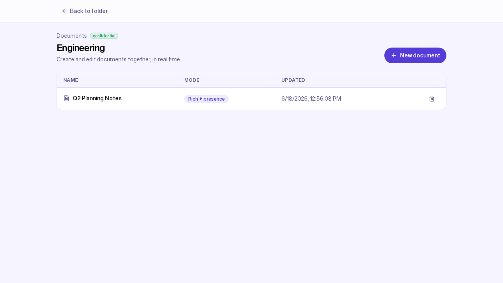

# 2. A day in the files

**Persona:** Knowledge worker (Bob Martinez, a member at Northwind Trading)
**Job to be done:** *"Find the document I need, open it, work on it, and trust
that the right people — and only the right people — can see it."*

---

Bob Martinez is an engineer. He does not care about encryption modes or storage
tiers; he cares about finding the file he needs in a few seconds and getting
back to work. This post follows the product from a member's side.

## A familiar drive that respects his role

When Bob signs in he sees an ordinary drive. Crucially, he sees **only what a
member should**: there is no **Admin** or **Billing** control in his header,
because those belong to admins. Same product, role-appropriate surface.

He can see the shape of the workspace — the folder tree down the side — but
seeing a folder in the tree is not the same as being able to open it.

## Access is least-privilege, and the product says so plainly

Bob opens `Engineering`. He has not been granted access to its contents, so ZK
Drive does not quietly show him an empty folder or, worse, leak a file list it
should not. It tells him exactly what happened:

> *"You don't have permission to do that."*

This is least-privilege working as intended. Membership in the workspace does
not imply access to every folder; access is granted per folder, per person.
When Bob needs in, an admin grants it through the standard permissions flow
(`POST /api/permissions`) with a role — viewer, commenter, or editor. Once
granted, the same folder behaves like any drive: the real uploaded files with
their type, size, and modified time, and per-file actions — download, edit,
share, delete — exactly where he expects them.

## Finding things by typing

Search is the feature a knowledge worker touches most. A search for
"architecture" returns the match instantly and shows **its full path**, so there
is no doubt about which copy is being opened:

Here that surfaces `architecture-overview.pdf` in `/Engineering/` and the
`/Engineering/Architecture/` folder. Search works because these live in
`managed_encrypted` folders: the server can read plaintext in memory while
handling a request, so it can build a full-text index over the content.
`strict_zk` folders deliberately give this up — the server only holds
ciphertext, so search there is metadata-only. That trade-off is the subject of
[Privacy you can actually explain](04-privacy-and-zero-knowledge.md).

## Uploading and keeping history

Uploads never route file bytes through the application tier. The browser asks
the server for a presigned upload URL (`POST /api/files/upload-url`), sends the
bytes **directly** to object storage, and then confirms
(`POST /api/files/confirm-upload`); the server only records metadata. That keeps
large uploads fast and the app tier lean.

Every confirmed upload to a `managed_encrypted` folder also queues background
work over NATS JetStream — preview generation, full-text indexing, and malware
scanning — fired asynchronously (`internal/jobs/publisher.go`). History is kept
automatically: Northwind's retention policy keeps the last 10 versions of a
file by default, and a stricter 25 on `Legal Contracts`.

## Documents live next to files

A drive is not only files. Inside a folder, the **Documents** view lists
collaborative documents — Northwind keeps a live **Q2 Planning Notes** document
in `Engineering`, in `rich_presence` mode:

Opening one drops Bob into a real-time editor where teammates edit together,
cursors and all. That experience gets its own post:
[Editing together, live](08-collaborative-editing.md).

---

### What this journey demonstrates

- **Zero learning curve:** folders, files, search, and per-file actions behave
  the way people already expect from a drive.
- **Role-appropriate UI and access:** members get exactly the surface they
  should, and the product is candid when access has not been granted.
- **Fast, out-of-band uploads:** bytes go straight to object storage; the app
  tier stays lean.
- **Search that works because of an honest privacy default**, not in spite of
  it.

Next: [Working with clients & partners →](03-external-collaboration.md)
