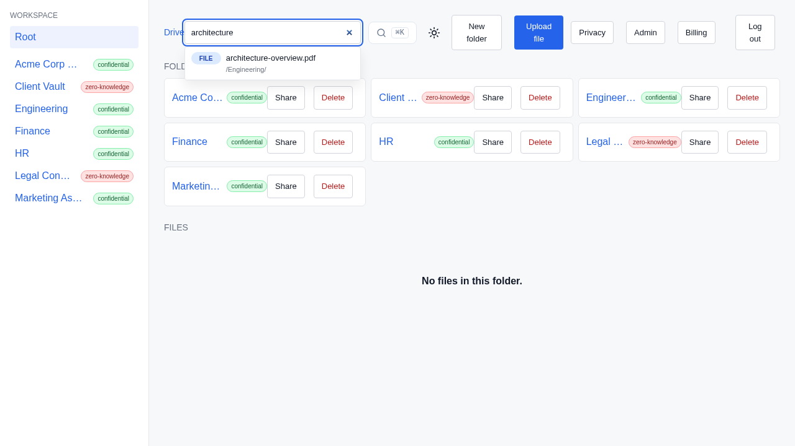

# 2. A day in the files

**Persona:** Knowledge worker (Bob, a member at Northwind Trading)
**Job to be done:** *"Find the document I need, open it, work on it, and trust
that the right people — and only the right people — can see it."*

---

Bob is an engineer. He does not care about encryption modes or storage tiers;
he cares about finding `architecture-overview.pdf` in three seconds and getting
back to work. This post follows his side of the product.

## A familiar drive that respects his role

When Bob signs in he sees a normal drive. Crucially, he sees **only what a
member should**: there is no **Admin** or **Billing** button in his header,
because those belong to admins. Same product, role-appropriate surface.

Inside `Engineering` (a folder he was granted **editor** access to), Bob sees
the real uploaded files with type, size, and modified time, plus per-file
actions — download, edit, share, delete — exactly where he expects them.

These are genuine uploaded objects, not placeholders: `api-spec-v3.yaml`
(382 B), `architecture-overview.pdf` (130 KB), `deployment-runbook.md`,
`load-test-results.png`, and `security-audit-2026.pdf` (103 KB). Sub-folders
(`Backend`, `Frontend`) nest naturally with their own privacy badges.

## Finding things by typing

Search is the feature a knowledge worker touches most. Bob types
"architecture" and ZK Drive returns the match instantly, showing the file and
**its full path** so he knows which copy he is opening:

Search runs against the live backend over the workspace's *confidential*
content. This is one of the concrete pay-offs of the default protection mode —
because the server can read plaintext in memory while handling a request, it
can build a full-text index. Zero-knowledge folders deliberately give this up
(metadata-only search), which is the trade-off we explain in
[post 4](04-privacy-and-zero-knowledge.md).

## Uploading, previewing, versioning

Uploads use presigned URLs: the browser sends file bytes **directly** to object
storage, and the API only ever records metadata and confirms the upload. That
keeps large uploads fast and keeps the application tier out of the data path.

Behind the scenes, every confirmed upload to a confidential folder queues work
on the async pipeline — preview generation, full-text indexing, virus scanning,
classification. In this demo the worker came online and drained that job
backlog cleanly (you can see all five worker types reporting healthy in
[post 6](06-operations-noops.md)).

> **Honest caveat — previews.** This minimal demo did not render thumbnail
> images. The preview *pipeline* ran, but the demo worker was pointed at a
> single default bucket while file content lives in per-tenant buckets, so the
> thumbnail render step had nothing to read. Preview generation is a real,
> shipped capability (PDF and image rendering via the worker); we are simply
> not going to show you a thumbnail we did not actually produce. Full-text
> search, which *did* run live, is the honest evidence of the same pipeline.

---

### What this journey demonstrates

- **Zero learning curve:** folders, files, search, and per-file actions behave
  the way people already expect from a drive.
- **Role-appropriate UI:** members get exactly the surface they should, with no
  admin clutter and no admin power.
- **Fast, out-of-band uploads:** bytes go straight to object storage; the app
  tier stays lean.
- **Search that works because of an honest privacy default**, not in spite of
  it.

Next: [Working with clients & partners →](03-external-collaboration.md)
