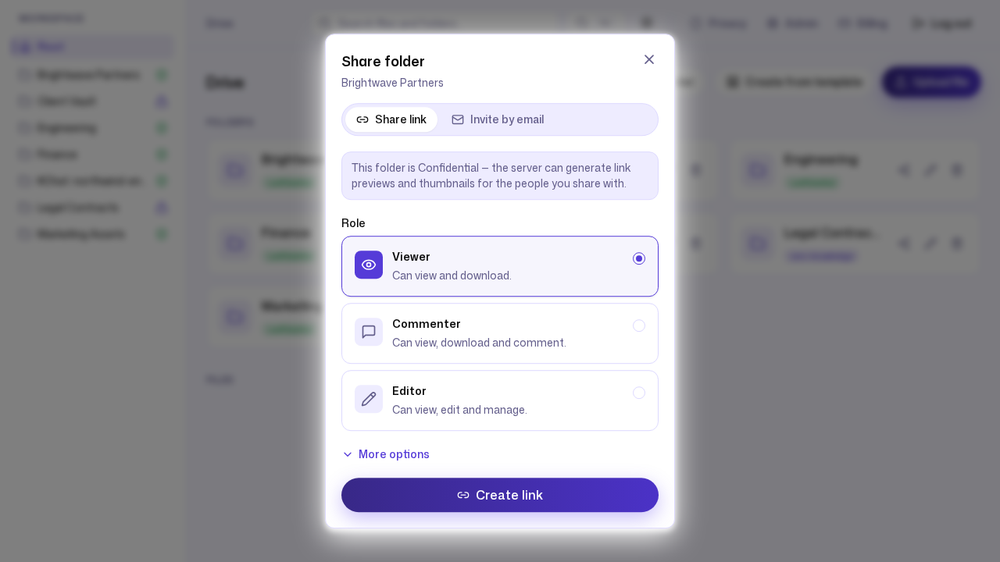
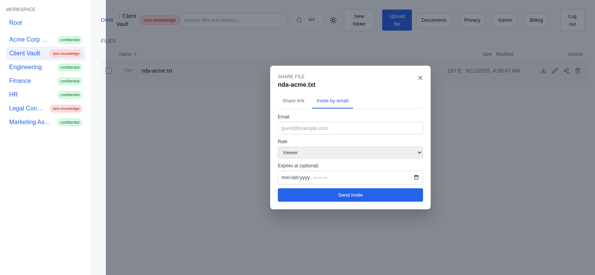

# 3. Working with clients & partners

**Persona:** Account / project lead (agency, consultancy, or professional-
services firm)
**Job to be done:** *"Get files to someone outside my company — and receive
files from them — without emailing attachments, and without losing control of
who can see what, for how long."*

---

External collaboration is where consumer drives get risky and enterprise tools
get heavy. For an agency or a professional-services firm, the job is to make
*governed* outside sharing feel as light as a public file link — but with the
controls the work actually requires. ZK Drive gives outside access three shapes:
share links, named guest invites, and client rooms.

## A share link with guardrails

From any folder or file, **Share → Share link** mints a link
(`POST /api/share-links`) with a role and a set of optional guardrails: a
**password**, an **expiry** (`expires_at`), and a **maximum download count**
(`max_downloads`). The role picker offers **Viewer**, **Commenter**, or
**Editor**, and the guardrails live under **More options**:

Notice the dialog is honest about the folder it is sharing: because Brightwave
Partners is a `managed_encrypted` ("Confidential") folder, it states plainly
that *"the server can generate link previews and thumbnails for the people you
share with."* Share a `strict_zk` folder instead and that line changes — there
are no server-side previews to offer.

This is the difference between "anyone with the link, forever" and a link that
expires on a date you choose, needs a password, and stops working after a set
number of downloads. Northwind seeds exactly this: a link on its
`architecture-overview.pdf` with the password `Architecture#2026`, an expiry of
`2026-12-31`, and a 25-download cap — plus a plainer viewer link on the whole
`Marketing Assets` folder for material that needs no lock.

## Inviting a named guest

Sometimes a link is too blunt and you want a *named* external collaborator. The
**Invite by email** tab creates a guest invitation (`POST /api/guest-invites`)
scoped to a folder, with a role:

Guest invites are folder-scoped — inviting on a file grants access to its parent
folder. Northwind uses one to bring `client@brightwave-partners.example` into
its **Client Vault** as a viewer. That is worth pausing on: Client Vault is a
`strict_zk` folder, so the invite is a deliberate, named, revocable grant into
the most tightly protected corner of the workspace — the scope, the role, and
the folder's zero-knowledge protection are all real.

The invite is recorded in the audit log as `sharing.guest_invite_emailed`
(`internal/audit/audit.go:65`).

> **Honest note — email delivery.** ZK Drive creates and records the invite
> regardless; whether an email actually leaves the building depends on a mail
> provider being configured for the deployment. The invite object — its scope,
> role, and expiry — is real either way; the delivery channel is a separate,
> optional piece of plumbing.

## Client rooms

For recurring engagements, a **client room** is a named, shared space
provisioned from a template (`POST /api/client-rooms/from-template`), backed by
a real folder in the same tree as everything else — so listing, permissions,
and search all work against it without special cases. Northwind's room is
**Brightwave Partners**, the folder pictured in the share dialog above. This is
the primitive consumer drives lack: a durable, governed home for one outside
relationship, rather than a scatter of one-off links.

---

### What this journey demonstrates

- **Links with real guardrails:** password, expiry, and download caps are
  first-class options, not enterprise add-ons.
- **Named guests, scoped tightly:** invite a specific person to a specific
  folder with a role — and it works even on a `strict_zk` vault.
- **Client rooms:** a durable, governed space per relationship, backed by an
  ordinary folder so every other feature applies.
- **Everything is audited:** every external grant lands in the tamper-evident
  log (see [Compliance & security evidence](05-compliance-and-security.md)).

Next: [Privacy you can actually explain →](04-privacy-and-zero-knowledge.md)
