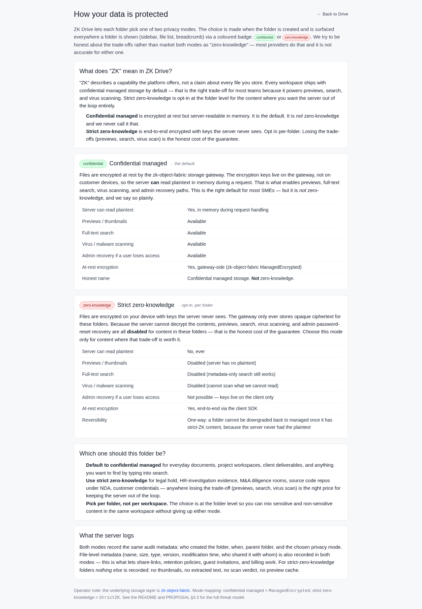
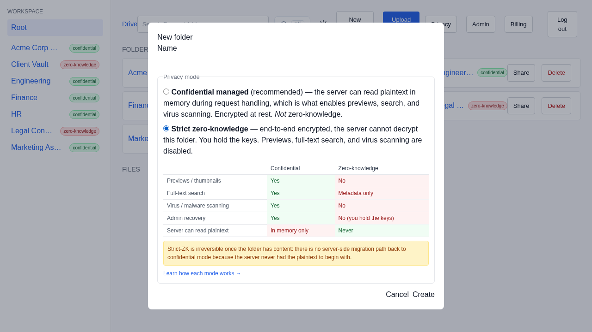
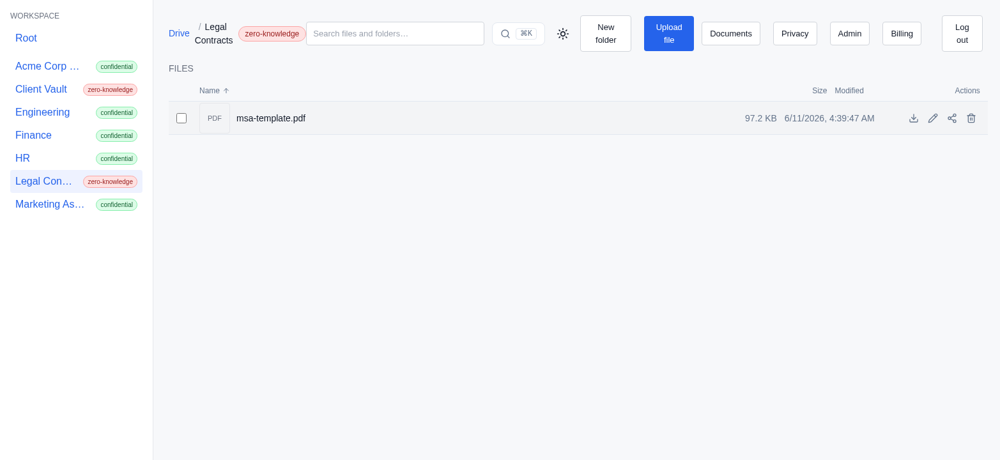

# 4. Privacy you can actually explain

**Persona:** Everyone — but especially the person who has to justify the tool to
a client or a regulator
**Job to be done:** *"Pick the right level of protection for each folder, and be
able to explain — honestly — what the vendor can and cannot see."*

---

This is the post that matters most, because it is where ZK Drive refuses to do
the thing every competitor does: market everything as "zero-knowledge" when it
is not. Each folder picks one of two privacy modes at creation time, and the
choice is surfaced everywhere the folder is shown.

## Two modes, one honest choice

ZK Drive ships a built-in explainer — **"How your data is protected"** — that
lays both modes out side by side, in plain language. Its own intro sets the
tone:

> *"We try to be honest about the trade-offs rather than market both modes as
> 'zero-knowledge' — most providers do that and it is not accurate for either
> one."*

### `managed_encrypted` — "Confidential managed" (the default)

Files are encrypted at rest by the storage gateway, but the keys live on the
gateway, so the server **can** read plaintext in memory while handling a
request. That is not a weakness to hide — it is precisely what enables previews,
full-text search, virus scanning, and admin recovery. For most SME content
(project files, deliverables, anything you want to find by typing) this is the
right trade-off. ZK Drive says so plainly and **never calls it zero-knowledge**.

### `strict_zk` — "Strict zero-knowledge" (opt-in, per folder)

Files are encrypted on the client with keys the server never sees; the gateway
only ever stores opaque ciphertext. Because the server cannot decrypt the
contents, previews, full-text search, virus scanning, and admin
password-reset recovery are all **disabled** — *"the honest cost of the
guarantee."*

The explainer renders the two modes as one symmetric comparison, which reads
exactly as it should:

| Capability | `managed_encrypted` | `strict_zk` |
| --- | --- | --- |
| Server can read plaintext | Yes, in memory during request handling | No, ever |
| Previews / thumbnails | Available | Disabled (server has no plaintext) |
| Full-text search | Available | Disabled (metadata-only search still works) |
| Virus / malware scanning | Available | Disabled (cannot scan what we cannot read) |
| Admin recovery if a user loses access | Available | Not possible — keys live on the client only |
| At-rest encryption | Yes | Yes, end-to-end via the client SDK |

## The choice is made where it matters — at folder creation

The same trade-off appears *inline* when you create a folder, so nobody chooses
zero-knowledge by accident or misunderstands what they are giving up:

Note the warning: choosing `strict_zk` is **one-way**. A folder cannot be turned
back to `managed_encrypted` once it holds strict-ZK content, because the server
never had the plaintext to work from. ZK Drive tells you this *before* you
commit, not in a support ticket afterward.

## You can mix both in one workspace

This is the practical superpower: the choice is **per folder, not per
workspace**. Northwind keeps `Engineering`, `Finance`, and `Marketing Assets` as
`managed_encrypted` — searchable and previewable — while `Legal Contracts` and
`Client Vault` are `strict_zk`. Here is a zero-knowledge folder: the files are
present with their metadata, but there is no thumbnail and no full-text index of
their contents, exactly as promised:

`Legal Contracts` holds `msa-northwind-2026.pdf` and `nda-template.docx` — real
encrypted objects the server stores as ciphertext. It can tell you their name,
size, and modified time, and it can enforce sharing and retention on them, but
it cannot read a word inside.

## What the server logs — in both modes

Both modes record the same audit metadata: who created the folder, when, its
parent, and the chosen privacy mode, plus file metadata (name, size, type,
modified time, and who shared it with whom) — that is what lets share links,
retention, guest invites, and billing work at all. For `strict_zk` folders
**nothing else** is recorded: no thumbnails, no extracted text, no scan verdict,
no preview cache.

For teams that must hold their own keys, the **Encryption (CMK)** admin screen
points ZK Drive at an external KMS (accepted URI schemes: `arn:aws:kms:`,
`kms://`, `vault://`, `transit://`) and sets the default mode for new folders.
The deeper compliance story lives in
[Compliance & security evidence](05-compliance-and-security.md).

---

### What this journey demonstrates

- **Honesty as a feature:** the product names its default *"confidential
  managed — not zero-knowledge"* in its own UI rather than overclaiming.
- **Informed, per-folder choice:** the trade-offs are shown at the decision
  point, including the one-way nature of `strict_zk`.
- **Mixed-mode workspaces:** searchable everyday folders and end-to-end
  encrypted vaults coexist — no all-or-nothing.
- **A clear line on logging:** the same explainer tells you exactly what is and
  is not recorded for each mode.

Next: [Compliance & security evidence →](05-compliance-and-security.md)
