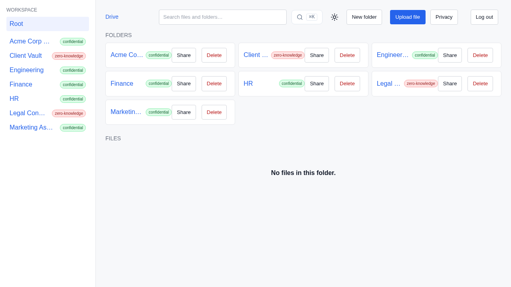

# 5. Compliance & security evidence

**Persona:** Security / compliance officer (Carol, second admin at Northwind)
**Job to be done:** *"Prove who did what and when, show that the record hasn't
been tampered with, and make sure a lost laptop or a rogue link can't expose the
whole company."*

---

When a client's security questionnaire arrives, or an auditor asks "show me the
access history for this folder," Carol needs answers that stand up to scrutiny —
not a CSV she could have edited herself.

## A tamper-evident audit log

ZK Drive keeps an HMAC **hash-chained** audit log: each entry incorporates the
previous entry's hash, so any insertion, deletion, or edit breaks the chain.
There is a `/api/admin/audit-log/verify` endpoint that recomputes the chain and
reports whether it is intact. Here is the **real response** from the seeded
Northwind workspace:

```json
{
  "workspace_id": "b8335126-d5c2-4ac9-a16f-1af590c30f4a",
  "valid": true,
  "rows_checked": 23,
  "head_seq": 23
}
```

`valid: true` across all 23 chained rows. This is not a claim in a brochure —
it is the verifier's output on live data.

The entries themselves carry the *who/what/when* an auditor expects. A sample of
the real, non-login events from the workspace:

```
permission.grant               | role=editor | grantee_type=user | resource=Engineering folder
permission.grant               | role=admin  | grantee_type=user | resource=Legal Contracts folder
admin.user_invite              | role=member | email=bob@northwind.example
admin.user_invite              | role=admin  | email=carol@northwind.example
sharing.guest_invite_emailed   | outcome=disabled
retention.policy_upsert        | max_age_days=365 | max_versions=10 | archive_after_days=90
workspace.ip_allowlist_rule_add| cidr=203.0.113.0/24 | label="HQ office egress"
```

Every sensitive action — granting access, inviting users, sharing externally,
changing retention, tightening network rules — is captured with its parameters.

## Least privilege, enforced

Access is role-based and folder-scoped. The **Users** screen shows the live
roster with per-user roles and an inline **Deactivate** control:


And the enforcement is visible from the other side: when member **Bob** signs
in, the **Admin** and **Billing** controls simply are not in his UI — he cannot
navigate to what he is not entitled to.



## Retention and lifecycle

Carol set a workspace retention policy — keep up to 10 versions, expire content
after 365 days, archive to cold storage after 90 — and it is recorded as a real
`retention.policy_upsert` audit event (above). Versioning, soft-delete/trash,
and cold archival are part of the platform, so "we keep the right things for the
right amount of time" is a setting, not a manual chore.

## Contain the blast radius

Two more controls reduce exposure:

- **IP allowlisting** — Carol added `203.0.113.0/24` ("HQ office egress") as an
  allow rule (enforcement left off in the demo to avoid locking ourselves out,
  but the rule and its audit entry are real).
- **Zero-knowledge folders** — for the most sensitive content (`Legal
  Contracts`, `Client Vault`), the server holds only ciphertext, so even a full
  server compromise cannot reveal plaintext. See
  [post 4](04-privacy-and-zero-knowledge.md).

## Per-user storage accountability

The **Storage** tab attributes usage per user — useful for both capacity
planning and spotting anomalies. Here Alice accounts for the seeded 596 KB while
the other members sit at zero, against the workspace total.


---

### What this journey demonstrates

- **Cryptographically verifiable audit trail** — `valid: true` over the whole
  chain, with a self-service verify endpoint.
- **Complete sensitive-action coverage** — grants, invites, external shares,
  retention, and network rules are all logged with parameters.
- **Enforced least privilege** — members cannot even see admin surfaces.
- **Lifecycle & blast-radius controls** — retention, IP allowlisting, and
  zero-knowledge folders for the crown-jewel data.

Next: [Operations without an ops team →](06-operations-noops.md)
