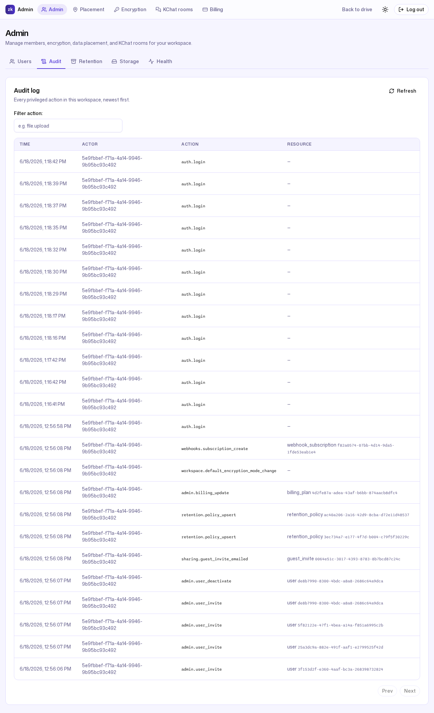
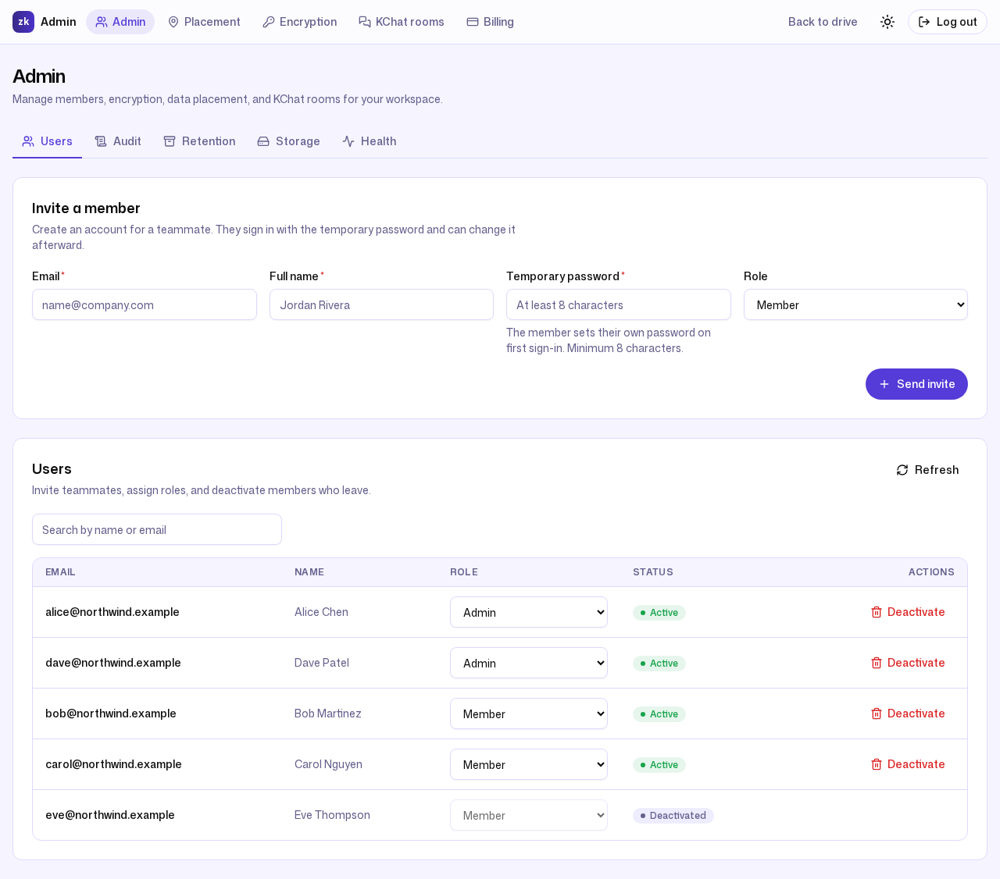
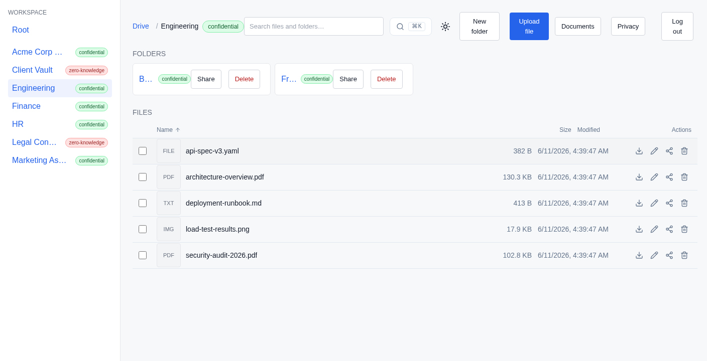
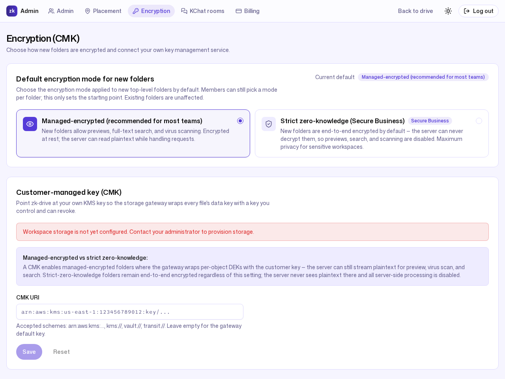
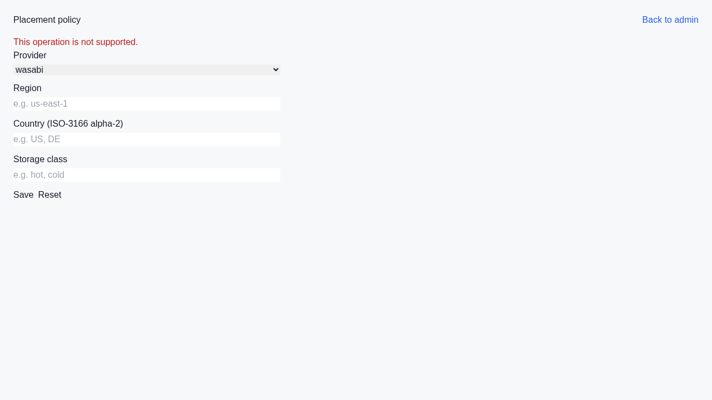

# 5. Compliance & security evidence

**Persona:** Dave Patel — the second admin at Northwind Trading, who fields
client security questionnaires and the occasional auditor
**Job to be done:** *"Prove who did what and when, show that the record can't
be quietly edited, and make sure a lost laptop or a stray link can't expose
the whole company."*

---

When a client's security questionnaire lands, or an auditor asks "show me the
access history for this folder," Dave needs answers that survive scrutiny —
not a spreadsheet he could have edited himself. ZK Drive is built so the
honest answer is always backed by evidence the workspace owner cannot forge.

## A tamper-evident audit log

ZK Drive keeps an HMAC **hash-chained** audit log. Every entry carries a
per-workspace sequence number, the previous entry's hash, and an HMAC computed
over the row's immutable fields (`internal/audit/audit.go:98-106`). Because
each row's hash feeds into the next, inserting, deleting, or editing any entry
breaks the chain from that point forward — a silent edit is mathematically
detectable.

The chain is keyed by a dedicated secret that never leaves the server, so a
workspace owner with database access still cannot recompute the chain to cover
their tracks. You don't have to take that on faith, either: the endpoint
`GET /api/admin/audit-log/verify` recomputes the entire chain server-side and
reports the result. Here is the **real response** from the seeded Northwind
workspace:

```json
{
  "workspace_id": "2dd8e7af-88a5-4a18-88b1-652c80a35117",
  "valid": true,
  "rows_checked": 12,
  "head_seq": 12
}
```

`valid: true`, with `rows_checked` equal to `head_seq` — every chained row
recomputed, the rows linked contiguously, and the final row matched the stored
chain head (`internal/audit/repository.go:151-167`). This is the verifier's
output on live data, not a claim in a brochure.

The admin console lists the entries newest-first, with the actor, action, and
timestamp an auditor expects:



Each row also carries its hash-chain fields, so the linkage is inspectable.
Two adjacent entries from the seeded workspace, captured from the API:

```json
{ "seq": 11, "action": "webhooks.subscription_create",
  "prev_hash":  "iDJh3I8lYMdlTgivk5oU6qp7JwMrYEncOmS+kdMjTYA=",
  "entry_hash": "tEmzbMU0unc6+xxwtdKdXZdiyNDkL+prWGL2+uZJ0xM=" }

{ "seq": 12, "action": "sharing.guest_invite_emailed",
  "prev_hash":  "tEmzbMU0unc6+xxwtdKdXZdiyNDkL+prWGL2+uZJ0xM=",
  "entry_hash": "EyKLV7RSxbkEcMLEz9Wpg/WcmKeX7z4RFdkKxpIbHBM=" }
```

Row 12's `prev_hash` is exactly row 11's `entry_hash`. Change a single field in
row 11 and that link no longer matches — which is precisely what `verify`
walks across the whole chain.

Every sensitive action is captured with its parameters. The seeded chain
includes member invites (`admin.user_invite`), an account deactivation
(`admin.user_deactivate`), retention changes (`retention.policy_upsert`), a
billing change (`admin.billing_update`), the workspace default-encryption-mode
change (`workspace.default_encryption_mode_change`), an outbound-webhook
subscription (`webhooks.subscription_create`), and an external guest invite
(`sharing.guest_invite_emailed`). Folder access grants and revocations
(`permission.grant` / `permission.revoke`), SSO and two-factor events, and
IP allow-rule changes are recorded the same way (`internal/audit/audit.go`).

One honest detail visible in the log: the guest-invite entry records an
outcome of *disabled*, because transactional email is not provisioned in this
demo deployment. The action is still recorded faithfully — the audit log tells
you what actually happened, including when a side effect was a no-op.

## Least privilege, enforced server-side

Access is role-based and folder-scoped. The **Users** screen shows the live
roster with each member's role and an inline control to deactivate an account:



Northwind runs with two admins — Alice Chen, the owner-admin, and Dave
Patel — and three members: Bob Martinez, Carol Nguyen, and Eve Thompson,
whose account is deactivated. The roles are not cosmetic. When member **Bob
Martinez** opens a folder he has not been granted, the server refuses — *"You
don't have permission to do that"* — and his top bar carries no **Admin** or
**Billing** controls at all:



That denial comes from the server, not from a hidden menu item. Permission is
checked on every request, per folder, so there is no client-side shortcut a
curious member could take to read content they shouldn't.

## Account protection that runs itself

Two controls reduce the chance of an account being taken over in the first
place:

- **Two-factor authentication (TOTP).** Members can enrol an authenticator
  app; enrolment, verification, and recovery-code use are themselves audited
  (`auth.mfa_enroll`, `auth.mfa_verify`, `auth.mfa_recovery_use`).
- **Single sign-on.** Google, Microsoft, and an OIDC provider can be wired so
  a workspace centralises identity, with SSO logins recorded as
  `auth.sso_login`.

Underneath, the gateway throttles abuse without any operator action. Per-user
and per-workspace rate limits bound request volume, and repeated failed logins
trip an automatic block: after a configured failure threshold an offending
source is blocked for a cooldown window (`internal/config/config.go`). A
workspace can also restrict access to known networks with IP allow rules, and
every rule change lands in the audit log (`workspace.ip_allowlist_rule_add`).

## Retention and lifecycle

Retention is a setting, not a manual chore. Northwind keeps a workspace-default
policy — up to **10 versions** per file, archived to cold storage after **365
days** — and a stricter policy on its most sensitive folder, **Legal
Contracts**, which keeps **25 versions** (`scripts/seed/seed.py:561-573`). Each
change is recorded as a `retention.policy_upsert` event, so "we keep the right
things for the right amount of time" is provable, not asserted. The day-to-day
view of these policies lives in
[Operations without an ops team](06-operations-noops.md).

## Where the bytes live, and who holds the keys

For regulated buyers, two screens govern the data itself.

The **Encryption (CMK)** screen sets the default encryption mode for new
folders and connects a customer-managed key. Its own copy states the trade-off
plainly:



- **Managed-encrypted** — Northwind's default — "allow[s] previews, full-text
  search, and virus scanning. Encrypted at rest; the server can read plaintext
  while handling requests."
- **Strict zero-knowledge** folders are "end-to-end encrypted … the server can
  never decrypt them, so previews, search, and scanning are disabled."

A **customer-managed key** wraps each file's data key with a key the customer
controls and can revoke. The screen is candid about scope: a CMK applies to
managed-encrypted folders (the gateway wraps per-object keys with your key
while still streaming plaintext for preview, scan, and search); strict
zero-knowledge folders stay end-to-end encrypted regardless of the setting. In
this demo the CMK panel reads *"Workspace storage is not yet configured"* —
binding a key needs the storage control plane, which we did not stand up here.

The **Placement policy** screen governs data residency — which provider,
region, and country your encrypted objects sit in:



It shows *"This operation is not supported"* for the same honest reason:
residency enforcement runs through the storage control plane, which is not
provisioned in this minimal demo. The controls are real product surface;
exercising them requires the storage backend to be stood up.

## One tenant can never see another's

Northwind is not the only workspace on the platform. **Lakeside Legal** — a
separate firm with its own owner-admin (Morgan Reyes) and its own folders
(`Client Matters` in strict zero-knowledge, `Case Briefs` managed-encrypted) —
runs alongside it (`scripts/seed/seed.py`). The two share infrastructure and
share nothing else.

Isolation is enforced at the data layer, not by hiding things in the UI. Every
authenticated request derives its workspace from the caller's token, and
queries are scoped to that workspace before they touch the database — "callers
cannot query a workspace they aren't part of" is the contract on the change
feed (`api/drive/changes.go:24-27`), and the same scoping governs files,
folders, search, and the audit log (the verify endpoint above reports a single
`workspace_id`). A Northwind admin cannot list, search, or audit a Lakeside
folder, and vice versa.

For the most sensitive content, isolation is reinforced by zero-knowledge.
Northwind's **Legal Contracts** folder is strict zero-knowledge — the server
stores only ciphertext, so even a full server compromise reveals nothing:


---

### What this journey demonstrates

- **A cryptographically verifiable audit trail** — `valid: true` over the
  whole chain, with a self-service verify endpoint and inspectable per-row
  hashes.
- **Complete sensitive-action coverage** — invites, deactivations, retention,
  billing, sharing, and configuration changes are logged with parameters.
- **Enforced least privilege** — folder permission is checked server-side, and
  members can't even see admin surfaces.
- **Account protection that runs itself** — TOTP, SSO, rate limiting, and
  automatic auth-failure blocking.
- **Data-sovereignty controls** — per-folder zero-knowledge, customer-managed
  keys, and residency placement, with honest callouts where the storage
  control plane must first be provisioned.
- **Hard tenant isolation** — the workspace boundary is applied on every
  request.

Next: [Operations without an ops team →](06-operations-noops.md)
