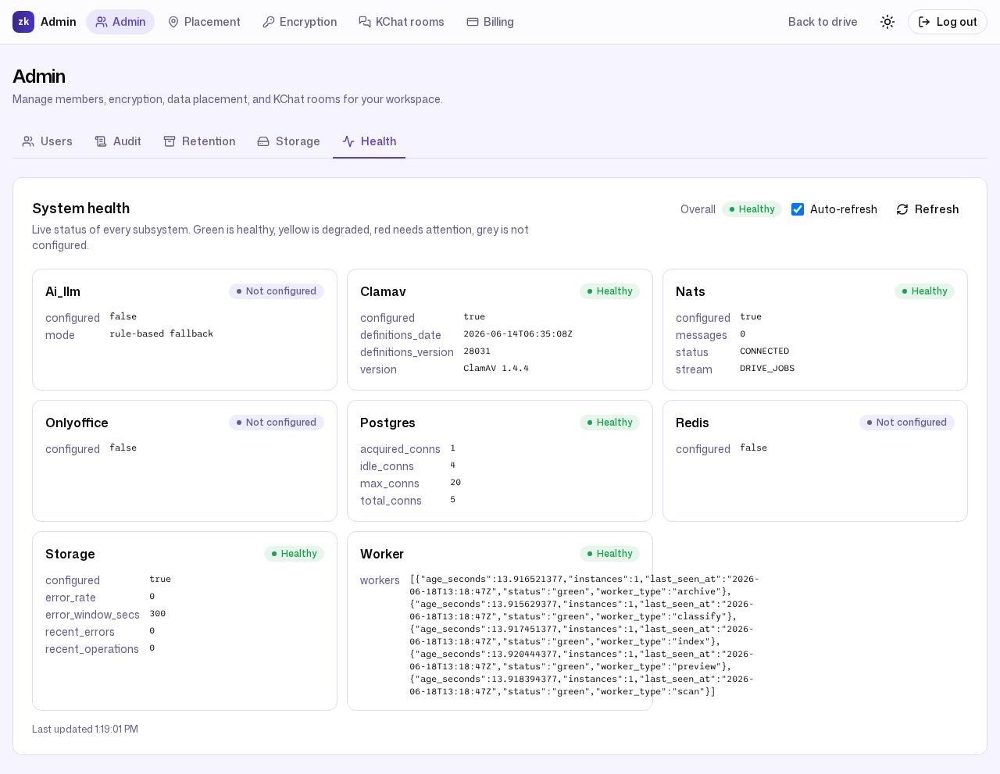
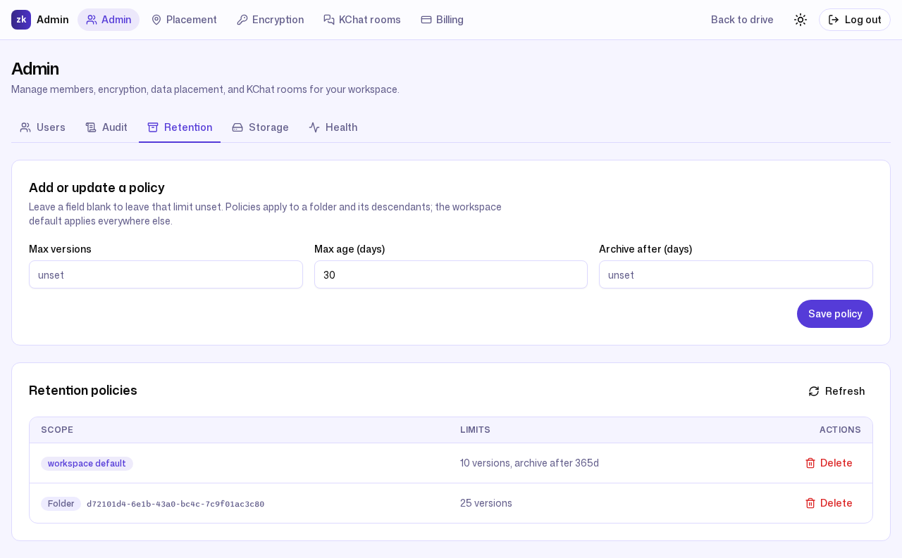
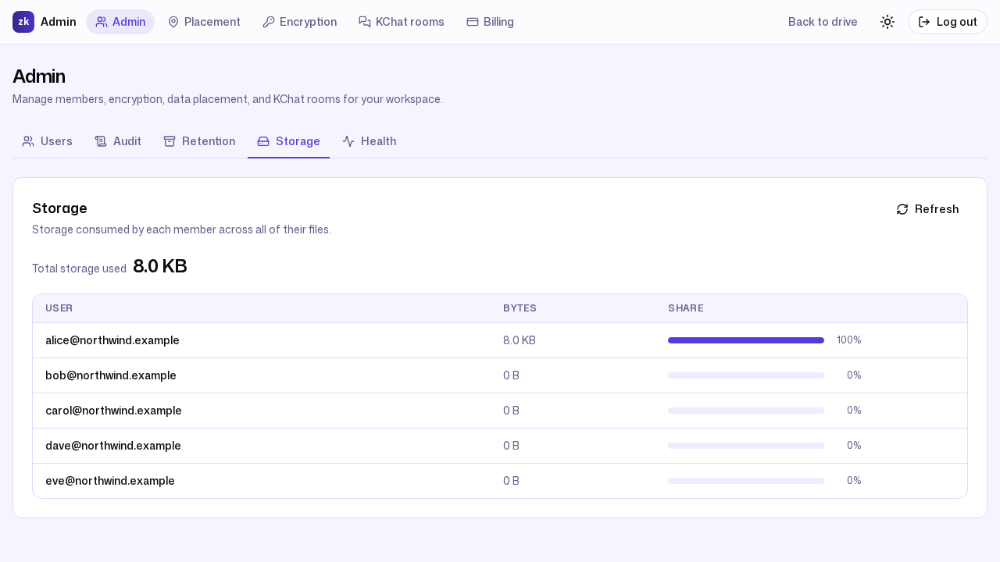

# 6. Operations without an ops team

**Persona:** Alice Chen — Northwind's owner-admin, the person who onboarded the
team and also does everything else
**Job to be done:** *"Tell me at a glance whether the system is healthy, and
don't make me run a query or read a log file to find out."*

---

SMEs do not staff a 24/7 on-call rotation. ZK Drive's operational story is
built for that reality: the work that would normally need a dedicated ops team
either runs itself or surfaces its status in plain language on a single screen.

## One screen that tells the truth

The **Admin → Health** tab is a live status board for every subsystem. Green is
healthy, yellow is degraded, red needs attention, grey is "not configured," and
it auto-refreshes. This is the real board from the seeded demo deployment:

Read it top to bottom, honestly:

- **Postgres — Healthy**, with live connection-pool stats (1 acquired, 4 idle,
  5 total against a max of 20). The metadata store is up and nowhere near
  saturated.
- **NATS — Healthy**, connected, stream `DRIVE_JOBS`, **0 pending messages** —
  the async job backlog has drained.
- **Worker — Healthy**, with all five worker types reporting green on fresh
  heartbeats: `archive`, `classify`, `index`, `preview`, and `scan`.
- **ClamAV — Healthy** (ClamAV 1.4.4, signature definitions dated
  2026-06-14). Malware scanning is provisioned and current here.
- **Storage — Healthy**, with a clean error window (0 errors over the last 300
  seconds). The object-storage data path is serving uploads and downloads.
- **AI summaries, OnlyOffice, Redis — Not configured.** Honestly greyed out:
  these optional subsystems were not provisioned in this deployment. ZK Drive
  keeps serving everything else and falls back gracefully — AI features use a
  rule-based path, and the rate limiter and live-collaboration fan-out run
  in-process on a single replica.

That last line is the whole point. A board that is always green is useless.
This one tells you exactly what is and isn't wired up, so the one optional
piece you might add — say, an OnlyOffice server for office-format editing — is
a deliberate choice rather than a mystery.

## Why "no-ops" is a design goal, not a slogan

- **Self-draining pipelines.** Every upload to a managed-encrypted folder
  queues preview, thumbnail, search-index, classify, and scan work on NATS
  JetStream; the worker fleet picks it up and the queue returns to zero on its
  own — no cron, no babysitting. The health board shows the result: `DRIVE_JOBS`
  at 0 pending once the workers are caught up.
- **Preview capacity that tunes itself.** The preview worker fleet is tiered
  into priority, standard, lightweight, and heavy lanes (defaults of `6`, `2`,
  `8`, and `4` workers), and each workspace gets an hourly preview budget
  (`PREVIEW_BUDGET_PER_WORKSPACE_HOUR`, default `100`) so one busy tenant can't
  starve the rest (`internal/config/config.go:827-833`). The defaults are
  sensible out of the box; an operator only touches them to tune an unusual
  workload.
- **Connection-pool visibility.** Postgres pool stats sit on the same screen,
  so capacity pressure is visible before it becomes an outage.
- **Honest degradation.** Optional components degrade to "not configured"
  instead of failing the whole system, and a genuinely broken subsystem turns
  red rather than pretending to be fine.

## Retention runs on a policy, not on reminders

Keeping storage tidy is automated. The **Retention** tab shows the policies in
force: a workspace default of **10 versions** per file with cold archival after
**365 days**, plus a stricter folder policy of **25 versions** on Legal
Contracts.

File versioning, trash/soft-delete, and cold archival run against these
policies automatically. The admin sets the rule once; the platform enforces it
on every file going forward, and the change is captured in the audit log (see
[Compliance & security evidence](05-compliance-and-security.md)).

## Storage usage you can actually read

The **Storage** tab attributes usage per member — useful for both capacity
planning and spotting anomalies:

In the seeded workspace the total is a tidy **8.0 KB**: Alice, who uploaded the
demo files, accounts for 100% of it, and every other member sits at 0 B. On a
real workspace the same view tells an admin who is consuming the pooled quota
long before a request ever bumps into the quota ceiling.

---

### What this journey demonstrates

- **At-a-glance health** for every subsystem, auto-refreshing, with real
  connection-pool and job-queue metrics.
- **A dashboard that tells the truth** — it shows exactly what is and isn't
  provisioned instead of papering over it.
- **Self-managing async pipelines** that drain themselves, with preview
  capacity budgeted per workspace.
- **Policy-driven retention** and **readable per-member storage**, so the
  everyday admin chores take care of themselves.

Next: [Honest assessment vs the competition →](07-honest-competitive-assessment.md)
