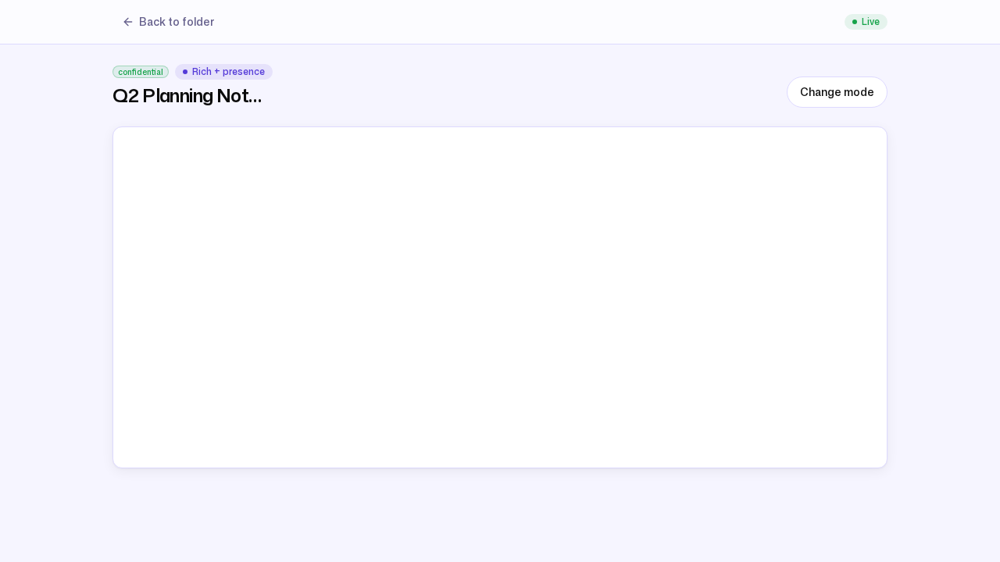
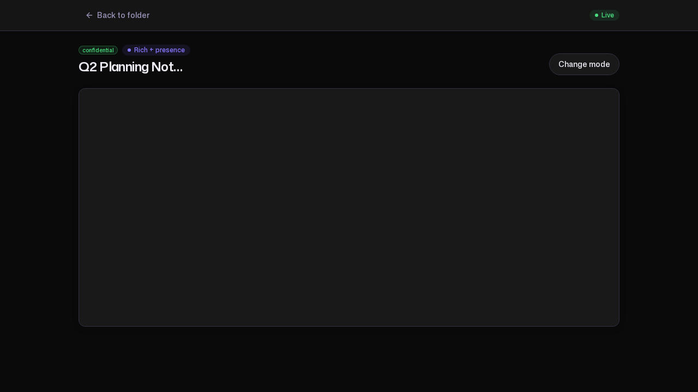

# 8. Editing together, live

**Persona:** Any team that drafts together (Northwind's engineers on their
planning notes)
**Job to be done:** *"Write a document with my colleagues in the same place at
the same time — see their cursors, never email a file around — without giving up
the privacy model the rest of the workspace runs on."*

---

A drive that only stores finished files makes people draft somewhere else and
paste the result back. ZK Drive closes that gap with **collaborative
documents**: real-time, multi-author editing that lives inside the same folders,
under the same permissions and the same privacy modes as everything else.
Northwind keeps a live **Q2 Planning Notes** document in `Engineering`.

## Four collaboration modes

A document's behaviour is set by its collaboration mode
(`internal/document/document.go:25-28`):

| Mode | What it gives you |
| --- | --- |
| `markdown` | Plain Markdown editing, no live presence |
| `rich` | Rich text (headings, lists, formatting) |
| `rich_presence` | Rich text **plus** live cursors and author presence |
| `disabled` | Editing turned off |

Q2 Planning Notes runs in `rich_presence` — the full experience.

## How real-time editing works

The editor is built on TipTap with a Yjs document underneath. Opening a document
establishes a WebSocket connection to `/api/documents/{id}/ws`, over which the
browser and server exchange **binary Yjs updates** — every keystroke is a small
conflict-free change, merged deterministically so two people typing in the same
paragraph never clobber each other. In `rich_presence`, a second channel carries
**awareness** frames: who is here and where their cursor is, drawn as the
presence chips and remote cursors you see in the editor.

The editor's badge reads **Rich + presence**, and the connection-status chip
shows the live link to the relay. The same screen in dark theme — the product
follows the workspace's light or dark preference throughout:

## Presence follows the privacy mode — by design

Live presence is not available everywhere, and that is deliberate. A document's
available modes are derived from its **folder's** privacy capability
(`internal/document/capability.go:76-79`): a `managed_encrypted` folder allows
the full set up to `rich_presence`, while a `strict_zk` folder allows only
`markdown`. The reason is the same honest line that runs through the whole
product — presence and rich server-side coordination need the server to handle
document state it cannot handle for content it is never allowed to read.

Because Q2 Planning Notes lives in `Engineering` (a `managed_encrypted` folder),
`rich_presence` is available and is the default ZK Drive picks for it. Create
the same document in a `strict_zk` folder and the richest mode offered is
`markdown` — collaboration still works, presence does not.

## Editing office files: the OnlyOffice option

For Word, Excel, PowerPoint, and their Open Document equivalents, ZK Drive can
bridge a file to an external **ONLYOFFICE Document Server** for in-place
collaborative editing. It is an optional integration, gated behind the
`onlyoffice` feature flag (`internal/feature/flags.go:44`) and pointed at a
Document Server via `ONLYOFFICE_URL`. Its reachability is surfaced on the admin
**Health** dashboard like any other subsystem
(`internal/health/dashboard_probes.go:402-425`).

The same privacy line holds here, enforced in code: because the Document Server
must read and write the file's plaintext, the bridge works **only** for
`managed_encrypted` folders. Asking for it on a `strict_zk` folder is refused
with `ErrStrictZKForbidden` (`internal/collab/onlyoffice.go:62`) — the server
will not hand plaintext to an editor for content it is not allowed to read.

> **Honest note.** OnlyOffice is an integration you connect, not something every
> deployment runs. When no Document Server is configured, the office-editing
> option is simply not offered; the native TipTap + Yjs editor above needs
> nothing extra and is what powers Q2 Planning Notes.

---

### What this journey demonstrates

- **Drafting lives in the drive:** real-time documents share the folders,
  permissions, and privacy modes of everything else.
- **True multi-author editing:** Yjs over a WebSocket relay merges concurrent
  edits; awareness drives live cursors and presence.
- **Privacy is consistent, not bolted on:** presence and rich coordination are
  available exactly where the folder's mode allows, and nowhere it does not.
- **Office files, optionally:** an OnlyOffice bridge handles Word/Excel/
  PowerPoint for `managed_encrypted` folders, and refuses `strict_zk` by design.

Next: [ZK Drive as KChat's storage backbone →](09-kchat-integration.md)
