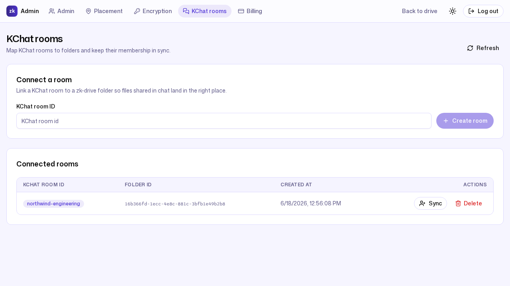

# 9. ZK Drive as KChat's storage backbone

**Persona:** Admin connecting team chat to governed storage (Northwind Trading)
**Job to be done:** *"Let my team share files in chat without those files
escaping the governance, permissions, and privacy rules the rest of the company
runs on."*

---

Most chat tools treat attachments as an afterthought — files scattered through
threads, outside any retention policy, impossible to audit. ZK Drive is the
storage backbone for **KChat**, so a chat room's files live in a real ZK Drive
folder with the same permissions, audit trail, retention, and privacy mode as
everything else. Northwind connects its engineering chat to a room called
`northwind-engineering`.

## A room is a folder

Mapping a KChat room to ZK Drive is one admin call. `POST /api/kchat/rooms`
takes a `kchat_room_id` and **auto-provisions a backing folder** for it
(`api/kchat/handler.go:71-98`). It is admin-only, because creating a room
provisions a folder and grants the caller admin on it, and a repeated POST for
an already-mapped room returns `409 Conflict` rather than silently minting a
duplicate.

Under the hood, `CreateRoomFolder` does three things in one step
(`internal/kchat/service.go:183-228`):

1. creates a folder named after the room — `folderNameFor` prefixes it with
   `KChat: ` (`internal/kchat/service.go:498-507`), so room `northwind-engineering`
   becomes the folder **`KChat: northwind-engineering`**;
2. persists the `(workspace, room) → folder` mapping; and
3. grants the creating admin permission on the new folder.

That `KChat: northwind-engineering` folder is the same one visible in
Northwind's drive root in [Standing up a workspace](01-onboarding-and-admin.md) —
nothing special, just a folder that happens to be wired to a chat room.

## Managing rooms

The admin **KChat rooms** screen lists every mapping in the workspace and the
folder behind it:

The same handler serves the rest of the surface (`api/kchat/handler.go:55-64`):
list and fetch mappings (`GET /api/kchat/rooms`, `GET /api/kchat/rooms/{id}`),
remove one (`DELETE /api/kchat/rooms/{id}`), reconcile chat membership into
folder permissions (`POST /api/kchat/rooms/{id}/sync-members`), and an optional
room summary (`POST /api/kchat/rooms/{id}/summary`). When a chat member is added
or removed, sync-members keeps the folder's access list in step, so the people
in the room are exactly the people who can reach its files.

## Attachments are just files

When someone drops a file in the room, it does not become a special "chat
attachment" — it becomes a normal ZK Drive file in the backing folder. The
upload uses the same presigned-URL path as the rest of the product
(`POST /api/kchat/attachments/upload-url` then
`/api/kchat/attachments/confirm`): bytes go straight to object storage, the
server records metadata. From there the file inherits folder permissions,
retention, audit, and search like anything else.

## Privacy mode carries over — exactly as you'd expect

This is the important part for a security-conscious admin. The backing folder is
created with the workspace's **default privacy mode for new folders** —
`managed_encrypted` out of the box — so a KChat room's attachments are
searchable, previewable, and malware-scanned by default, because the folder
allows it. Set the workspace default to `strict_zk` (or keep the room's content
in a zero-knowledge folder) and those server-side capabilities switch off for
that folder, exactly as described in
[Privacy you can actually explain](04-privacy-and-zero-knowledge.md). There is
no separate, weaker rulebook for chat files; they obey the same per-folder model
as the rest of the drive.

---

### What this journey demonstrates

- **Chat files are governed files:** every room maps to a real folder with full
  permissions, audit, and retention — not an ungoverned attachment store.
- **One call to connect a room:** `POST /api/kchat/rooms` provisions the folder,
  records the mapping, and grants the admin — and refuses duplicates.
- **Membership stays in sync:** room membership reconciles into folder
  permissions, so access and presence in chat match access in the drive.
- **The privacy model is the same one:** a room's files are as protected as the
  folder behind them, with no chat-specific exceptions.

Next: [Back to the series index →](README.md)
