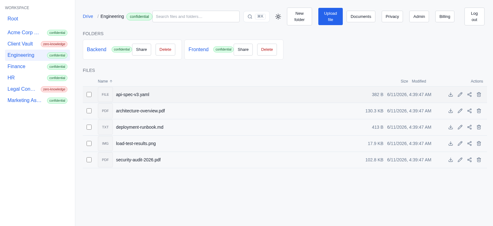

# 10. Desktop sync

**Persona:** A Northwind engineer who works in the **Engineering** folder every
day and wants it on their laptop like any other directory
**Job to be done:** *"Mirror a workspace folder to my machine so I can work in
my normal editor and tools, with the same access and privacy rules the
workspace enforces online."*

---

A drive that only lives in a browser tab is not where real work happens. ZK
Drive ships a **cross-platform desktop sync client** — built with Tauri v2 —
that mirrors a workspace folder to a local directory and keeps the two in step.
Northwind uses it to keep the **Engineering** folder on the team's laptops.



## What it is

The desktop app pairs a small React/TypeScript interface with a Rust host
(`desktop/`). The host drives a shared Rust **sync SDK** — a Cargo workspace of
six focused crates (`sdk/crates/`) — so one engine can back the desktop app, a
headless daemon, and other native clients:

| Crate | Responsibility |
|---|---|
| `zk-sync-api` | Typed HTTP / WebSocket client: presigned upload/download, the workspace change feed, folder and file metadata |
| `zk-sync-auth` | OAuth2 PKCE login and a token source backed by the OS keychain |
| `zk-sync-crypto` | XChaCha20-Poly1305 envelope, byte-for-byte compatible with the server's encryption SDK |
| `zk-sync-engine` | Local SQLite catalogue, filesystem watcher, change-feed poller, reconciliation loop, and conflict policy |
| `zk-sync-shell` | Multi-workspace harness exposing a `Command` / `ShellEvent` surface any GUI host drives |
| `zk-sync-cli` | A headless `zk-sync` daemon binary |

The desktop UI is a handful of screens — **Login**, **Sync status**,
**Settings** (selective sync), and a **conflict dialog** (`desktop/README.md`)
— and the app builds to a native installer per platform: `.dmg`/`.app` on
macOS, `.msi` on Windows, `.AppImage`/`.deb` on Linux.

## Sign in once; tokens live in the OS keychain

The client authenticates with **OAuth2 PKCE** using the native-app loopback
flow (RFC 8252): it generates a PKCE challenge, binds an ephemeral loopback
listener on `127.0.0.1`, opens the system browser at the provider's authorize
URL with that loopback `redirect_uri`, captures the authorization code, and
exchanges it for tokens (`sdk/crates/auth`, `desktop/README.md`). Those tokens
are persisted in the **OS keychain** — under the `com.zkdrive.desktop` service
— rather than a plaintext config file, and a refreshing token source renews
them transparently. The engineer signs in through their browser as usual; the
laptop holds a refreshable token in the platform credential store, not a
password.

The desktop app owns the client side of this flow; accepting the loopback
`redirect_uri` at the backend token endpoint is owned by the backend and kept
deliberately separate from the desktop code (`desktop/README.md`).

## How sync stays correct: the change feed

The server exposes a durable, monotonically-ordered **change feed** of every
state-mutating operation in a workspace — file, folder, permission, and
document changes (`internal/changefeed/changefeed.go`). The desktop client
consumes it in two complementary modes:

- **Catch-up**, on connect or reconnect, over cursor-paged REST:
  `GET /api/changes?since=N` returns every mutation after sequence `N` in
  ascending order, with a `cursor` and `has_more` so the client pages until it
  is current (`api/drive/changes.go:24-48`). A companion
  `GET /api/changes/latest` returns the highest sequence, so a fresh client can
  learn where the workspace stands before going live.
- **Live**, while connected, over the workspace WebSocket: the server pushes
  the same envelope for each mutation as it lands.

Both modes share one envelope shape, so the client's reconciliation logic is
identical between catch-up and live:

```json
{
  "sequence": 1234,
  "kind": "file",
  "op": "update",
  "resource_id": "…",
  "parent_id": "…",
  "name": "deployment-runbook.md",
  "occurred_at": "…"
}
```

`kind` is one of `file`, `folder`, `permission`, or `document`; `op` is
`create`, `update`, `rename`, `move`, or `delete`
(`internal/changefeed/changefeed.go`). Crucially, change-feed writes are
**synchronous** on the server — unlike fire-and-forget telemetry, a mutation is
recorded before the request returns, so a sync client never falls out of step
because a buffer overflowed.

When a teammate renames `deployment-runbook.md` in Engineering from the web,
the server records a `rename` mutation; the laptop receives it over the
WebSocket (or on its next catch-up page) and renames the local file in place —
it does not re-download the folder.

## Selective sync and conflicts

The desktop **Settings** screen presents a per-folder policy picker
(`offline` / `online` / `ignore`), and the app includes a conflict-resolution
dialog. The sync engine itself reconciles concurrent edits with a
**last-writer-wins** policy that keeps the displaced edit as a
`.conflict.<timestamp>` side copy rather than discarding it
(`sdk/crates/sync-engine/src/conflict.rs`).

Here the product is candid about its own surface. The shell's command set
covers adding and removing a workspace binding, pausing and resuming sync,
querying status, and authentication. The per-folder policy and manual
conflict-resolution actions are **not part of that command surface**, so
choosing them returns a structured *"unsupported"* response that the interface
shows verbatim rather than silently doing nothing (`desktop/README.md`). The
UI wiring is in place; the engine commands behind those two controls are the
honest gap.

## Configuration

The client reads two environment variables (`desktop/README.md`):

| Variable | Default | Purpose |
|---|---|---|
| `ZK_DRIVE_BASE_URL` | `https://drive.example.com` | Backend gateway base URL |
| `ZK_DRIVE_OAUTH_CLIENT_ID` | `zk-drive-desktop` | OAuth2 client id for PKCE + refresh |

Binding state is persisted to `<config-dir>/zk-drive/app.json`, and the local
mirror's catalogue is a SQLite database the engine maintains.

## Privacy travels with the folder

Sync does not weaken the workspace's privacy model. Access is unchanged: every
change-feed read is scoped server-side to the caller's workspace
(`api/drive/changes.go:24-27`), so the client only ever sees what the signed-in
member is entitled to. Content protection travels too — the SDK carries a
client-side encryption envelope (`zk-sync-crypto`, XChaCha20-Poly1305) that is
byte-for-byte compatible with the server's encryption SDK, the building block
for keeping a `strict_zk` folder's bytes end-to-end encrypted on the device
while the server holds only ciphertext. A `managed_encrypted` folder like
Engineering syncs through presigned upload and download against that same
gateway.

---

### What this journey demonstrates

- **A real cross-platform sync client** (macOS / Windows / Linux) built on a
  shared Rust SDK.
- **Browser-based OAuth2 PKCE login** with tokens in the OS keychain, not a
  config file.
- **A durable, ordered change feed** — cursor-paged catch-up plus a live
  WebSocket — that keeps a local mirror correct without re-downloading folders.
- **Privacy that travels** — the same per-folder encryption and access rules
  apply to synced folders.
- **Candor about the edges** — selective-sync and conflict-resolution surfaces
  exist, and the client says plainly which engine commands stand behind them.

← Back to the [series index](README.md)
